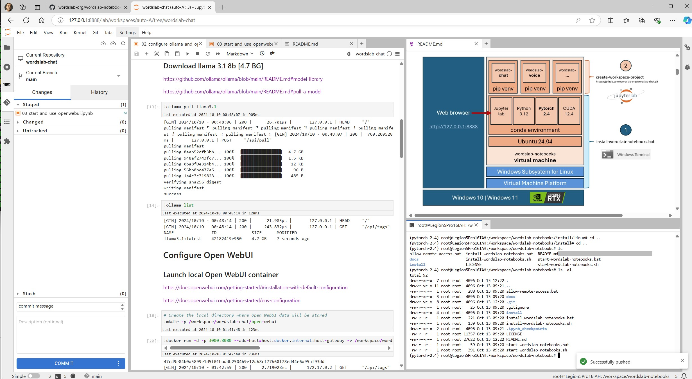

# wordslab-notebooks - "your AI at home"

**wordslab-notebooks** provides a one click installer to set up a **GPU-accelerated workspace** on your local gaming PC or on a cloud hosted virtual machine to use and develop **local AI applications**.

What you need
- a computer with a **x64 processor** (Intel or AMD) and at least 16 GB of RAM
- a SSD disk with at least 25 GB space free (100 GB recommended)
- a **Nvidia GPU** - RTX 3060 or higher - with 8 GB of VRAM or more
- If you own a **gaming PC at home**: Windows 10 or 11 (latest updates) - administrator privileges are necessary only if Windows Subsystem for Linux is not already installed on your machine or if you want to enable remote access
- If you rent a **virtual machine in the cloud**: Ubuntu Linux 22.04 or 24.04 with root access
- Note: Apple silicon, AMD GPU and Intel or Qualcomm NPU processors are not supported yet

What you will get
- a fully featured AI development environment based on **Jupyterlab notebooks** with popular tools and extensions
- a consistent installation of all the GPU-accelerated Python libraries you need to start your projects right away (see list below)
- scripts and tutorials to guide you through the whole development lifecycle (with Github and Huggingface)
- all that contained within a single "wordslab-notebooks" directory on your Windows machine

Don't be deceived by the apparent simplicity of this solution: **simplicity is the main feature of the product**. 

It is the result of many iterations over 4 years to converge to this lightweight and seamless experience. You will see over time that everything you try just works out of the box.

WARNING: this local AI development environment is meant to be used **for personal use only, on a computer which is not directly accessible from the internet**
- ease of use was prioritized for a single user in a safe environment
- **no access control or security measures** are implemented

> wordslab-notebooks screenshot



> wordslab-chat screenshot


> wordslab-images screenshot


## Documentation sections

- [Windows installation instructions](#windows-installation-instructions) (use your gaming PC at home)
  - [Start and stop Jupyterlab](#5-start-jupyterlab-and-test-your-environment)
  - [Allow access from other computers on your local network](#7-optional-allow-access-to-your-wordslab-notebooks-workspace-from-other-computers-on-your-local-network)
  - [Backup and restore your local environment](#8-optional-backup-and-restore-your-local-environment)
- [Linux installation instructions](#linux-installation-instructions) (rent a cheap GPU in the cloud)
  - [Get access to a Linux Virtual machine](#get-access-to-a-linux-virtual-machine)
- [User manual - Start your first AI projects](#user-manual---start-your-first-ai-projects)
  - [1. Learn to use the wordslab-notebooks Jupyterlab environment](https://github.com/wordslab-org/wordslab-notebooks-tutorials?tab=readme-ov-file#wordslab-notebooks-tutorials)
  - [2. Explore local implementations of the most frequent AI applications](#2-explore-local-implementations-of-the-most-frequent-ai-applications)
    - [wordslab-chat](https://github.com/wordslab-org/wordslab-chat) 
    - [wordslab-images](https://github.com/wordslab-org/wordslab-images)
    - [wordslab-voice](https://github.com/wordslab-org/wordslab-voice)
    - [wordslab-documents](https://github.com/wordslab-org/wordslab-documents)
    - [wordslab-code](https://github.com/wordslab-org/wordslab-code)
    - [wordslab-data](https://github.com/wordslab-org/wordslab-data)
  - [3. Initialize your first project](#3-initialize-your-first-project)
- [Windows installation script details](#windows-installation-script-details)
  - [Uninstall wordslab-notebooks](#uninstall-wordslab-notebooks-from-your-windows-machine)
- [Linux installation script details](#linux-installation-script-details)

## Windows installation instructions


### Update your system software to the latest version

Go to Windows Settings -> Windows Update and make sure the latest version of Windows 10 or 11 is installed.

If you have a Nvidia GPU: open GeForce Experience -> Drivers tab and make sure the latest version of the Nvidia device driver is installed.

### 1. Choose the parent directory where you want to install wordslab-notebooks

If you choose the parent directory: *C:\\wordslab*

All files (wordslab-notebooks software, your data and later downloads) will be stored inside the directory: *C:\\wordslab\\**wordslab-notebooks***

Check that there is enough space on the disk: **25 GB minimum**, 50 GB recommended. If you plan to download 100 GB of librairies and data for your project, you will need 100 (project) + 25 (wordslab-notebooks) = 125 GB of disk space.

Make sure that the directory you choose is not automatically mirrored in the cloud by a tool like OneDrive or DropBox. The wordslab-notebooks virtual machine disk is stored as a single file: it changes constantly and can get very large.

### 2. Open a Windows Terminal and navigate to the parent directory

Click on the Windows button in the taskbar.


Type "cmd" and then press Enter to open a Windows Terminal.


Create the parent directory if it doesn't already exist: *mkdir c:\\wordslab\\*

Navigate to the parent directory: *cd c:\\wordslab\\*


### 3. Download wordslab-notebooks scripts

Copy and paste the commands below in the Terminal to download wordslab-notebooks scripts on your machine:

Click on the copy icon on the top right of the code section below.

Click on the Terminal, press [Ctrl + v], and then don't forget to press [Enter] to execute the last line.

```
curl -L -o wordslab-notebooks.zip https://github.com/wordslab-org/wordslab-notebooks/archive/refs/heads/main.zip
tar -x -f wordslab-notebooks.zip
del wordslab-notebooks.zip
ren wordslab-notebooks-main wordslab-notebooks
cd wordslab-notebooks
```

Windows will warn you that all the commands will be executed: that's ok, this is what you want to do, click "Paste anyway".


###  4. Install wordslab-notebooks virtual machine

Copy and paste the command below in the same Terminal to install wordslabs-notebooks on your machine:

```
install-wordslab-notebooks.bat
```


Note: this procedure will download and unpack around 21 GB of software
- on a fast computer with a 300 MBits/sec internet connection, this operation takes **9 minutes**
- the disk size of the .\\wordslab-notebooks directory after install is **21.2 GB**

The script will install Nvidia CUDA software on your machine, you need to accept the NVIDIA End User licence agreement before using wordslab-notebooks:

[License Agreement for NVIDIA Software Development Kits — EULA](https://docs.nvidia.com/cuda/eula/index.html)

Note: if the Windows Subsystem for Linux needs to be installed on your machine
- you will have to click twice on the Yes button to authorize the script to make changes to your machine


- the script will start the Windows Subsystem for Linux installation and exit, then **you will have to reboot** your machine to finish the installation
- you can choose to reboot immediately by pressing Y, or to reboot later by pressing N


- after reboot, you will need to reopen a Terminal
- navigate to the wordslab-notebooks install directory (for example: *cd C:\\wordslab\\wordslab-notebooks*)
- then execute *install-wordslab-notebooks.bat* **a second time**


You can take advantage of the next 9 minutes of installation time to read a description of all the actions executed on your computer: [installation script details](#windows-installation-script-details).

Here is what your terminal should look like at the end of the installation:


WARNING: this local AI development environment is meant to be used **at home, on a computer which is not accessible from the internet**
- ease of use was prioritized for a single user in a safe environment
- **no access control or security measures** are implemented
- this virtual machine is not safe to use on a shared computer or in the cloud
- anybody can start the virtual machine without any authentication
- they have **root access** to the virtual machine and all its contents
- the tools inside the virtual machine also run as root and have full access to all your data

### 5. Start Jupyterlab and test your environment

Each time you want to start your local AI development environment, you need to repeat the following steps:
- open the Windows File Explorer
- navigate to the wordslab-notebooks installation directory
- then double-click on the script below

```
start-wordslab-notebooks.bat
```


You could also create a shortcut by right-clicking the script -> Other options -> Create shortcut, and then cut (Ctrl-X) & paste (Ctrl-C) this shortcut on your Windows Desktop.

The script [start-wordslab-notebooks](https://github.com/wordslab-org/wordslab-notebooks/blob/main/start-wordslab-notebooks.sh) launches a Jupyterlab environment
- on the port 8888 of your local machine (you can simply update this value in the script if you want to change the port number)
- without authentication and without acces restrictions for other machines on your local network 

**Leave the Terminal open** as long as you want to use Jupyterlab: you will see logs displayed on the screen as you work in Jupyterlab, this is normal, you can ignore them.


**Open your browser** and navigate to the following URL: [http:127.0.0.1:8888](http:127.0.0.1:8888).

You can also Ctrl-click on the link which is displayed in the Terminal.

You should see Jupyterlab with a file navigator on the left side of the screen.


Double-click on the /wordslab-notebooks-tutorials directory, then double-click on the file 00_discover_noteboooks.ipynb
- a notebook should be displayed in the center of the screen
- read its contents and click on the links to learn how to use Jupyterlab

Double-click on the file 01_explore_hardware.ipynb
- go to the top menu bar, click on Run, select Run All Cells
- check if your hardware is correctly detected (CPU, GPU, RAM ...)

Double-click on the 02_explore_software.ipynb
- go to the top menu bar, click on Run, select Run All Cells
- discover all the software available in your local virtual machine

### 6. Stop Jupyterlab after your work session

When your work session with Jupyterlab is finished
- please **make sure that you have saved** all the opened files
- click on the Terminal from which you launched Jupyterlab and which should still be open
- press the following two keys to stop the server, then confirm by pressing the key [y]

```
[Ctrl + c]
```


All your work and the current configuration of your development environment will be saved until your next work session in the virtual machine disk file stored at the following location on your PC:

> c:\\wordslab\\wordslab-notebooks\\wsl-vm\\ext4.vhdx


### 7. [optional] Allow access to your wordslab-notebooks workspace from other computers on your local network

You may want to leave your huge deep learning machine in the basement, and access your wordslab-notebooks environment from a slim and light laptop in the comfort of your living room.

For this, you need to configure the deep learning machine on which you just launched wordslab-notebooks to allow incoming remote requests from your local network.

First make sure that only trusted members of your family can connect to your local network. 

You will need to execute the script below **EACH TIME after you start wordslab-notebooks** *(because Windows assigns a new network address to your wordslab-notebooks virtual machine each time you use start-wordslab-notebooks.bat)*, and **each time you want to open a new port** on your virtual machine.

You need **administrator privileges** to allow remote access to your wordslab-notebooks virtual machine
- open the Windows File Explorer
- navigate to the wordslab-notebooks installation directory
- then double-click on the script below
  
```
allow-remote-access.bat
```


By default, this script will allow access to the 6 default ports :
- 8888 - Jupyterlab
- 7960 - Gradio apps
- 8000 - fastapi, fasthml & VLLM services
- 6900 - argilla.io annotation tool
- 8080 - Open WebUI chat user interface
- 8081 - VS Code server


If you need to open remote access to additional ports, you can pass them as arguments to the script (space separated list), for example:

```
allow-remote-access.bat 8001 8002 8003
```

You will now be able to access your wordslab-notebooks instance from another machine on you local network using the URL displayed by the script, for example:

> You can now access your wordslab-notebooks environment from a remote machine at this URL: http://192.168.1.24:8888

Don't forget to start you wordslab-notebooks environment as explained in step 5 before allowing the remote access.

### 8. [optional] Backup and restore your local environment

Synchronizing every few minutes your local workspace projects with cloud-based Github and Huggingface repositories should be the primary way to ensure that you don't loose too much work or data in the likely event that your unreliable home computer crashes or is infected by a virus.

You may also want to **compress and backup the virtual machine disk regularly** (only after wordslab-notebooks is stopped) if the files in your workspace are important.

First download and install 7zip file archiver if it is not yet available on your computer:

```
curl -L -o 7z-installer.exe https://www.7-zip.org/a/7z2406-x64.exe
7z-installer.exe /S
del 7z-installer.exe
```

Then, each time you want to backup your wordslab-notebooks environment, execute the commands below, after adjusting:
- the source directory: replace c:\\wordslab with the parent directory you selected for installation
- the target directory: replace d:\\backup with the location of your choice
- the backup date: replace 2024-06-16 with the date of your choice

```
wsl --shutdown
"%ProgramFiles%\\7-Zip\\7z" a -v1g "d:\\backups\\wordslab-notebooks-2024-06-16.7z" "c:\\wordslab\\wordslab-notebooks\\wsl-vm\\ext4.vhdx"
```

Notes
- the compression of a 20 GB vhdx file takes approximately 5 minutes on a 12 cores / 24 threads computer
- with a compression ratio around 50%: the backup files are approximately 10 GB in size
- we generate 10 files of 1 GB instead of a single file of 10 GB as it may be easier to transfer the backup files to a cloud drive

To **restore the virtual machine disk after an incident**, execute the following commands (after replacing your backup directory and date as before):

```
wsl --shutdown
"%ProgramFiles%\\7-Zip\\7z" e d:\\backup\\wordslab-notebooks-2024-06-16.7z.001 -oc:\\wordslab\\wordslab-notebooks\\wsl-vm\\
```

Notes
- this is much faster and should only take around 10 seconds on a fast computer
- be careful not to overwrite a valid state of your wordslab-notebooks environment with an old backup

## Linux installation instructions

### Get access to a Linux Virtual machine

If you already own a Linux virtual machine with a Nvidia GPU:
- make sure it runs Ubuntu 22.04 or 24.04 (other versions may also work but they are not tested)
- **make sure that you can use your virtual machine as the root user** (wordslab-notebooks is optimlized for a single user test environment at home, it assumes you will work directly as the root user for simplicity)
- log in as root and update your operating system before starting the installation procedure: apt update && apt upgrade

If you don't, you will need to rent a virtual machine in the cloud: you can rent virtual machines running on consumer GPUs for as low as 0.15-0.20 $ per hour, which means that if you only use your virtual machine 4 hours per day for a personal project at home, your bill will be in the 25$-30$ range. This can be a really cost-effective solution compared to the option of buying a 1500$ gaming PC.

The best options for renting GPUs in the cloud are changing every month, but the two options below have been around for quite some time and are recommended for their simplicity.

#### vast.ai

https://vast.ai

#### jarvislabs.ai

https://jarvislabs.ai/

### 1. Download wordslab-notebooks install scripts

```bash
curl -L -o wordslab-notebooks.zip https://github.com/wordslab-org/wordslab-notebooks/archive/refs/heads/main.zip
tar -x -f wordslab-notebooks.zip
rm wordslab-notebooks.zip
mv wordslab-notebooks-main wordslab-notebooks
cd wordslab-notebooks
```

### 2. Install or update basic Linux packages and configure the virtual machine

```bash
bash ./install/linux/0_install-ubuntu-packages.sh
```

### 3. [optional] Install Pytorch and CUDA if they are not already available

Most virtual machines with GPUs you can rent in the cloud are provided with Pytorch and CUDA already pre-installed: in this case you can skip this step.

You can check if everything is installed and working as expected with the following command (you may need to activate a conda environment first depending on the way your virtual machine was set up):

```bash
python -c "import torch; print(f'PyTorch version: {torch.__version__}'); print(f'CUDA version: {torch.version.cuda}'); print(f'GPU model: {torch.cuda.get_device_name(0)}')"
```

> PyTorch version: 2.4.0
> CUDA version: 12.4
> GPU model: NVIDIA GeForce RTX 3070 Ti Laptop GPU

If PyTorch is not found or if the installed version is too old, install the latest versions of Pytorch and CUDA in a new conda environement byt executing the following script:

```bash
bash ./install/linux/1_install-python-envmanager.sh
bash ./install/linux/2_install-pytorch-cuda.sh
```

### 4. [optional] Install Jupyterlab if it is not already available

Most virtual machines with GPUs you can rent in the cloud are provided with Jupyterlab already pre-installed: in this case you can skip this step.

If you access your virtual machine through a Jupyterlab interface, you can move to next section.

If you access your virtual machine through ssh, install Jupyterlab with the following command:

```bash
bash ./install/linux/3_install-jupyterlab-workspace.sh
```

### 5. Configure the Jupyterlab installation for wordslab-notebooks

Coming soon.

### 6. [optional] Start and stop Jupyterlab manually if it is not already provided

Note: you may need to first update the script below to adjust the port number on which the Jupyterlab web server is started so that Jupyterlab is remotely accessible: check the documentation of your cloud provider.

```bash
bash ./start-wordslab-notebooks.sh
```

**Leave the Terminal open** as long as you want to use Jupyterlab: you will see logs displayed on the screen as you work in Jupyterlab, this is normal, you can ignore them.

**Open your browser** and navigate to the URL corresponding to your cloud virtual machine: https://yourcloudvirtualmachine:8888.

When your work session with Jupyterlab is finished
- please **make sure that you have saved** all the opened files
- click on the Terminal from which you launched Jupyterlab and which should still be open
- press the following two keys to stop the server, then confirm by pressing the key [y]

```
[Ctrl + c]
```

Depending on the cloud service you use :
- all your work and the current configuration of your development environment will be **saved** until your next work session in the virtual machine disk if you **pause** the virtual machine (and you will be billed for the storage cost)
- - all your work and the current configuration of your development environment will be **lost** forever if you **delete** the virtual machine (and you will not be billed for the storage cost)
 
In the second case, it is very important to make sure that you saved all your work and data in Github and Huggingface hub for example before you delete your virtual machine.
  
## User manual - Start your first AI projects

### 1. Learn to use the wordslab-notebooks Jupyterlab environment

https://github.com/wordslab-org/wordslab-notebooks-tutorials

### 2. Explore local implementations of the most frequent AI applications

#### wordslab-chat

Local implementation of a fully featured ChatGPT like conversational assistant.

https://github.com/wordslab-org/wordslab-chat

#### wordslab-images

Local implementation of state of the art image generation and processing techniques.

https://github.com/wordslab-org/wordslab-images

#### wordslab-voice

Local implementation of state of the art voice transcription and generation techniques.

https://github.com/wordslab-org/wordslab-voice

#### wordslab-documents

Local implementation of state of the art OCR and document processing techniques.

https://github.com/wordslab-org/wordslab-documents

#### wordslab-code

Local implementation of an AI-assisted code development workflow.

https://github.com/wordslab-org/wordslab-code

#### wordslab-data

Local implementation of machine learning and deep learning algorithms to work on structured data.

https://github.com/wordslab-org/wordslab-data

### 3. Initialize your first project

1. Initialize a Github project.

2. Open a Terminal then execute the following command:

```
create-workspace-project https://github.com/your-org/your-repo.git
```

3. Navigate to the directory named 'your-repo', and open a notebook with the kernel named 'your-repo'.

## Windows installation script details

The installation script will execute the following steps in order:

[windows/1_install-or-update-windows-subsystem-for-linux](https://github.com/wordslab-org/wordslab-notebooks/blob/main/install/windows/1_install-or-update-windows-subsystem-for-linux.ps1) 

Checks if the Windows Subsystem for Linux is already installed on your machine:
- if WSL is already installed: it will just try to update it to the latest version and move on
- if WSL needs to be installed: it will install WSL, then **you will have to reboot** your machine to finish the installation
- after reboot, you will need to reopen a Terminal and navigate to the wordslab-notebooks install directory (for example: *cd C:\\wordslab\\wordslab-notebooks*), then execute *install-wordslab-notebooks.bat* **a second time**

[windows/2_create-linux-virtual-machine](https://github.com/wordslab-org/wordslab-notebooks/blob/main/install/windows/2_create-linux-virtual-machine.bat)

Creates a Windows Subsystem for Linux virtual machine named **'wordslab-notebooks'** 
- minimal image of the Ubuntu Linux 24.04 distribution


### Uninstall wordslab-notebooks from your Windows machine

The two scripts below can be used to fully uninstall wordslab-notebooks from your machine.

Navigate to the directory: *C:\wordslab\wordslab-notebooks\install\windows*.

**WARNING**: all the code and data stored in your virtual machine will be **irremediably lost** !

1. Delete the wordslab-notebooks virtual machine

Execute the script: *98_delete-linux-virtual-machine.bat*

2. Uninstall Windows Subsystem for Linux and Virtual Machine Platform from your Windows machine

Execute the script: *99_uninstall-windows-subsystem-for-linux.bat*

## Linux installation script details

[linux/0_install-ubuntu-packages](https://github.com/wordslab-org/wordslab-notebooks/blob/main/install/linux/0_install-ubuntu-packages.sh)

Installs basic Linux packages and configures the Linux virtual machine
- sudo locales ca-certificates
- iputils-ping net-tools traceroute openssh-client
- curl wget unzip
- less vim tmux screen
- **git git-lfs**
- htop nvtop
- build-essential cmake
- ffmpeg
- **docker-ce** docker-ce-cli containerd.io docker-buildx-plugin docker-compose-plugin


[linux/1_install-python-envmanager](https://github.com/wordslab-org/wordslab-notebooks/blob/main/install/linux/1_install-python-envmanager.sh)

Installs a minimal Python environment manager
- Miniforge 3

[2_install-pytorch-cuda](https://github.com/wordslab-org/wordslab-notebooks/blob/main/install/linux/2_install-pytorch-cuda.sh)

Creates a new conda environment named **'pytorch-2.4'**. 

Installs the following Python packages and system librairies:
- python 3.12.7
- **cuda 12.4.0**
- **pytorch 2.4.0**, torchvision 0.19.0, torchaudio 2.4.0
- pandas 2.2.3, scikit-learn 1.5.2


Creates a **/models directory** inside the virtual machine where all datasets, models code and weights will be downloaded.

Sets the following environment variables to achieve this goal:
- HF_HOME=/models/huggingface
- FASTAI_HOME=/models/fastai
- TORCH_HOME=/models/torch
- KERAS_HOME=/models/keras
- TFHUB_CACHE_DIR=/models/tfhub_modules

The 'pytorch-2.4' conda environment is automatically activated when you log in to the virtual machine.

[3_install_jupyterlab_workspace](https://github.com/wordslab-org/wordslab-notebooks/blob/main/install/linux/3_install_jupyterlab_workspace.sh)

Installs the Jupyterlab notebooks environment with the following plugins
- jupyterlab 4.2.5 - notebooks development environment
- jupyterlab_execute_time 3.2.0 - execution time of each cell
- jupyterlab-nvdashboard 0.11.00 - graphs to monitor cpu, gpu and memory load
- jupyterlab-git 0.50.1 - visual git UI to version your notebooks and files


Creates a **/workspace directory** inside the virtual machine where all Jupyterlab config, notebooks and project directories will be stored.

Sets the following environment variables to achieve this goal:
- JUPYTER_CONFIG_DIR=/workspace/.jupyter/etc/jupyter
- JUPYTER_DATA_DIR=/workspace/.jupyter/share/jupyter
- JUPYTER_RUNTIME_DIR=/workspace/.jupyter/share/jupyter/runtime
- JUPYTERLAB_SETTINGS_DIR=/workspace/.jupyter/lab/user-settings
- JUPYTERLAB_WORKSPACES_DIR=/workspace/.jupyter/lab/workspaces

When you log in to the virtual machine, the terminal is automatically positionned in the /workspace directory.

Installs two scripts to help you initialize or delete workspace projects inside Jupyterlab
- [/usr/local/bin/create-workspace-project](https://github.com/wordslab-org/wordslab-notebooks/blob/main/install/linux/create-workspace-project)
- [/usr/local/bin/delete-workspace-project](https://github.com/wordslab-org/wordslab-notebooks/blob/main/install/linux/delete-workspace-project)

The usage of these scripts will be described below in more details when we explain the lifecycle of a workspace project.

Creates a first workspace project in /workspace/wordslab-notebooks-tutorials with **the wordslab-notebooks tutorials** found at https://github.com/wordslab-org/wordslab-notebooks-tutorials.
