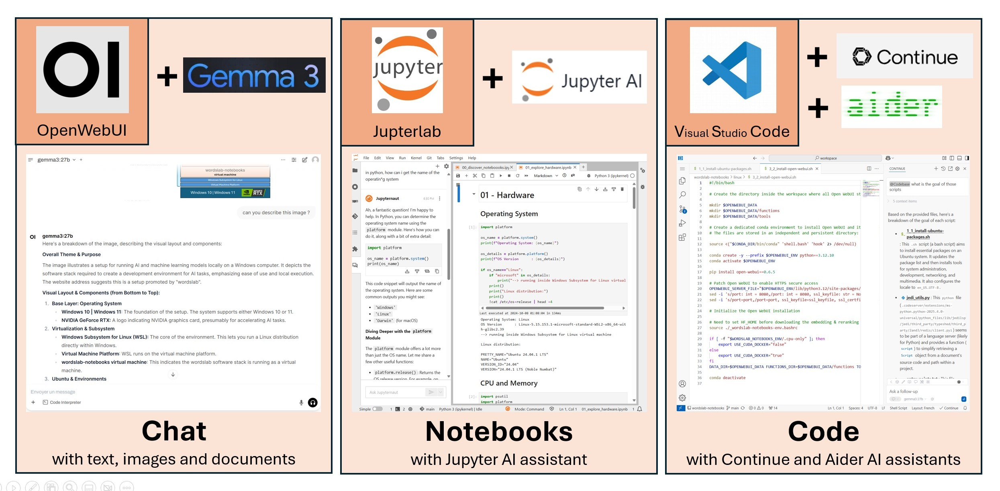

# Wordslab notebooks

*Learn, explore and build AI applications on your own machine*

**Quick Windows commands**

> Install

```shell
set "WORDSLAB_WINDOWS_HOME=C:\wordslab" && call set "WORDSLAB_WINDOWS_WORKSPACE=%WORDSLAB_WINDOWS_HOME%\virtual-machines\wordslab-workspace"  && call set "WORDSLAB_WINDOWS_MODELS=%WORDSLAB_WINDOWS_HOME%\virtual-machines\wordslab-models" && call set "WORDSLAB_VERSION=2025-11" && call curl -sSL "https://raw.githubusercontent.com/wordslab-org/wordslab-notebooks/refs/tags/%WORDSLAB_VERSION%/install-wordslab-notebooks.bat" -o "%temp%\install-wordslab-notebooks.bat" && call "%temp%\install-wordslab-notebooks.bat"
```

> Start

```shell
set "WORDSLAB_WINDOWS_HOME=C:\wordslab" && call "%WORDSLAB_WINDOWS_HOME%\start-wordslab-notebooks.bat"
```

## Overview


One click install of all the tools you need to learn, explore and build AI applications on your own machine.

- Recent and compatible versions of the  best open source tools
- Optimized work environment to save disk space and memory
- Options to leverage your own machines at home or to rent more powerful machines in the cloud 
- Documentation to guide you in your AI learning and exploration journey
	
3 main applications

- A rich chat interface (text, images, voice) : Open WebUI
- A notebooks platform (text & code) : JupyterJab + Jupyter AI extension 
- A development environment (code) : Visual Studio Code + Continue.dev extension + Aider terminal agent



Installs a ready to use and fully integrated AI environment with

- A visual dashboard to help you navigate all applications and manage your machine resources
- Optimized inference engines to run AI models : Ollama + vLLM

Why use this instead of a popular cloud services like ChatGPT ou Gemini ?

- Free solution with no rate limits if you already own a powerful machine
- Confidentiality and privacy of your data and projects
- Choose what tools and models you install and **when you upgrade**
- Understand how AI works and build your own solutions 

## Installation overview

When installed on Windows, wordslab-notebooks leverages the Windows Subsystem for Linux to create and run a lightweight Linux virtual machine
- No impact on the configuration of your windows machine
- Everything is contained in three virtual disks files: software, workspace, models
- You can choose a different location for these three files to optimize your local storage

When installed on Linux, wordslab-notebooks is directly installed in one to three directories of your choice.

You can install, start and access wordslab-notebooks with just 3 commands


Don't be deceived by the apparent simplicity of this solution: **simplicity is the main feature of the product**. 

This lightweight and seamless experience is the result of **many iterations over 3 years** of tests and research. 

You will see over time that **everything you try just works out of the box**.

## Installation options


Local PC requirements

- Windows 10 or 11, Ubuntu Linux 22.04+
- x64 CPU (Intel or AMD), 16 GB RAM
- 50 GB free disk space (see [more details here](./docs/install-local.md#storage-directories-size-mb---version-2025-11))
- Nvidia GPU recommended but not mandatory, RTX 3000 or newer, at least 8 GB VRAM
- CPU-only install possible, if you plan to use models hosted in the cloud in combination with your own PC
- Administrator access (except if the Windows Subsystem for Linux is already installed on your Windows machine)

Not supported: Apple machines, ARM processors, AMD GPUs.

If your machine doesn't meet these minimal requirements, you can rent a powerful machine for less than 1$ per hour from one of the following supported GPU cloud providers

- [Runpod.io](https://www.runpod.io/pricing) 
- [Vast.ai](https://vast.ai/pricing)
- [Jarvislabs.ai](https://jarvislabs.ai/pricing)

Guides to choose a provider and install wordslab on a rented machine are provided below.

Another option is to install wordslab on your local machine without a proper GPU, and to subscribe to a cloud service to run your AI models in the cloud

- Advantages: this is probably the cheapest option, you only pay for the tokens you generate, you keep your projects and most of your data local
- Drawbacks: you send all your conversations to a cloud service, they are no longer private, and you loose some flexibility and choice in the models you can run

Examples of such cloud services 
	
- [OpenRouter](https://openrouter.ai/)
- [OpenAI](https://platform.openai.com/docs/pricing) / [Anthropic](https://www.anthropic.com/pricing#api) / [Google](https://ai.google.dev/gemini-api/docs/pricing) / [Mistral](https://mistral.ai/pricing#api-pricing)
- [Huggingface inference](https://huggingface.co/docs/inference-providers/index)
- [Replicate](https://replicate.com/)

Some of these providers have generous free tiers which can get you started without a credit card.

If you have two machines at home

- a powerful - but hot and noisy - gamer PC in your home office
- a weaker - but cold and quiet - slim laptop in your living room
 
You can also install wordslab-notebooks in a client/server setting at home, where you run your AI models on your gamer PC and access your applications through a web browser running on your slim laptop.

If you get serious building AI solutions, you will certainly use a combination of all three options at different times: one or more local machines, a more powerful virtual machine rented in the cloud for a specific experiment, and hosted AI models for frontier performance.

WARNING: the local AI development environment is meant to be used **for personal use only, on a computer which is not directly accessible from the internet**
- Ease of use was prioritized for a single user in a safe environment
- **No access control or security measures** are implemented

## Table of contents

- [Installation instructions](#installation-instructions)
  - [Option 1 - Local PC](#option-1---local-pc)
  - [Option 2 - Local client and local server](#option-2---local-client-and-local-server)
  - [Option 3 - Local client and cloud server](#option-3---local-client-and-cloud-server)
  - [Update your installation to a more recent version](#update-your-installation-to-a-more-recent-version)
  - [Installation scripts documentation](./docs/install-scripts-reference.md)
  - [Backup and restore your local environment](#backup-and-restore-your-local-environment)
  - [Uninstall wordslab-notebooks](#uninstall-wordslab-notebooks)
- [User manual](#user-manual)
   - [Wordslab notebooks dashboard](#wordslab-notebooks-dashboard)
   - [Chat with OpenWebUI](#chat-with-openwebui)
   - [Learn and explore with JupyterLab](#learn-and-explore-with-jupyterlab)
   - [Develop with Visual Studio Code](#develop-with-visual-studio-code)
   - [Configure and use external services](#configure-and-use-external-services)

## Installation instructions

### Option 1 - Local PC

Local PC requirements

- Windows 10 or 11, Ubuntu Linux 22.04+
- x64 CPU (Intel or AMD), 16 GB RAM
- 50 GB free disk space (see [more details here](./docs/install-local.md#storage-directories-size-mb---version-2025-11))
- Nvidia GPU recommended but not mandatory, RTX 3000 or newer, at least 8 GB VRAM
- CPU-only install possible, if you plan to use models hosted in the cloud in combination with your own PC
- administrator access (except if the Windows Subsystem for Linux is already installed on your Windows machine)

Not supported yet: Apple machines, ARM processors, AMD GPUs.


#### Detailed installation instructions with screenshots

For the first installation, it is recommended to follow the [detailed installation instructions](./docs/install-local.md).

For the followinig installations, if you are already familiar with the procedure, you can just run the quick commands below.

#### Quick Windows commands

> Install

```shell
set "WORDSLAB_WINDOWS_HOME=C:\wordslab" && call set "WORDSLAB_WINDOWS_WORKSPACE=%WORDSLAB_WINDOWS_HOME%\virtual-machines\wordslab-workspace"  && call set "WORDSLAB_WINDOWS_MODELS=%WORDSLAB_WINDOWS_HOME%\virtual-machines\wordslab-models" && call set "WORDSLAB_VERSION=2025-11" && call curl -sSL "https://raw.githubusercontent.com/wordslab-org/wordslab-notebooks/refs/tags/%WORDSLAB_VERSION%/install-wordslab-notebooks.bat" -o "%temp%\install-wordslab-notebooks.bat" && call "%temp%\install-wordslab-notebooks.bat"
```

> Start

```shell
set "WORDSLAB_WINDOWS_HOME=C:\wordslab" && call "%WORDSLAB_WINDOWS_HOME%\start-wordslab-notebooks.bat"
```

#### Quick Linux commands

> Run wordslab commands as root

You need to run the commands to install or start wordslab-notebooks below as root.

If you didn't log in as root, first execute:

```bash
sudo bash
```

Then enter your password.

> Install

```bash
apt update && apt install -y curl && export WORDSLAB_HOME=/home/wordslab && export WORDSLAB_WORKSPACE=$WORDSLAB_HOME/workspace && export WORDSLAB_MODELS=$WORDSLAB_HOME/models && export WORDSLAB_VERSION=2025-11 && curl -sSL https://raw.githubusercontent.com/wordslab-org/wordslab-notebooks/refs/tags/$WORDSLAB_VERSION/install-wordslab-notebooks.sh | bash
```

> Start

```bash
export WORDSLAB_HOME=/home/wordslab && $WORDSLAB_HOME/start-wordslab-notebooks.sh
```

### Option 2 - Local client and local server

Please note that only Windows client machines are supported.


#### Server machine installation

First, **install the server machine** using the instructions provided above in [Option 1 - Local PC](#option-1---local-pc).

On the server machine, get the server machine IP address or DNS name with one of the commands below:

```shell
# Windows
ipconfig

# Linux
ifconfig
```

Take note if the IP v4 address of the server machine, for example: 192.168.1.28

#### Windows client machine commands

1. Prepare client machine

Execute one of the two commands below depending on your client machine status.

On the client machine, if wordslab-notebooks is not yet installed:

```shell
set "WORDSLAB_WINDOWS_HOME=C:\wordslab" && call set "WORDSLAB_VERSION=2025-11" && call curl -sSL https://raw.githubusercontent.com/wordslab-org/wordslab-notebooks/refs/tags/%WORDSLAB_VERSION%/prepare-client-machine.bat -o "%temp%\prepare-client-machine.bat" && call "%temp%\prepare-client-machine.bat"
```

On the client machine, if wordslab-notebooks is already installed :

```shell
set "WORDSLAB_WINDOWS_HOME=C:\wordslab" && call set "WORDSLAB_VERSION=2025-11" && call cd "%WORDSLAB_WINDOWS_HOME%\wordslab-notebooks-%WORDSLAB_VERSION%" && call prepare-client-machine.bat
```

2. Generate secrets for the server machine

On the client machine, generate a tar file containing secrets for a specific server machine: this script will prompt you for:
- the IP address of the server machine that you collected in the previous step, for example: 192.168.1.28
- optional: a password to protect access to Jupyterlab and Visual Studio Code - just type Enter if you don't need a password

```shell
set "WORDSLAB_WINDOWS_HOME=C:\wordslab" && call set "WORDSLAB_VERSION=2025-11" && call cd "%WORDSLAB_WINDOWS_HOME%\wordslab-notebooks-%WORDSLAB_VERSION%" && call prepare-server-secrets.bat
```

This script will generate the file: %WORDSLAB_WINDOWS_HOME%\secrets\wordslab-server-192.168.1.28-secrets.tar (where 192.168.1.28 is replaced with your server machine IP address).

The script output should look like:

```
Please enter a password for accessing this remote machine (or leave empty for no password):
192.168.1.29 will be accessible without password

The secrets for the remote wordslab-notebooks server are stored in C:\wordslab-client3\secrets\wordslab-server-192.168.1.28-secrets.tar

Now you need to transfer these secrets to the server machine: please refer to the documentation at https://github.com/wordslab-org/wordslab-notebooks/.
```

IMPORTANT: you will need to regenerate this secrets file each time the server IP address or DNS name changes.

#### Server machine commands

3. Transfer the secrets tar file (for example "wordslab-server-192.168.1.28-secrets.tar") to the server machine:

Execute one of the two steps below depending on your server operating system.

On a Windows server machine: 
- create the %WORDSLAB_WINDOWS_HOME%\secrets directory if it doesn't exist (for example c:\wordslab\secrets)
- copy the tar file in the %WORDSLAB_WINDOWS_HOME%\secrets directory (for example c:\wordslab\secrets\wordslab-server-192.168.1.28-secrets.tar)

On a Linux server machine: 
- create the $WORDSLAB_WORKSPACE/.secrets if it doesn't exist (for example /home/workspace/.secrets)
- copy the tar file in the $WORDSLAB_WORKSPACE/.secrets directory (for example /home/workspace/.secrets/wordslab-server-192.168.1.28-secrets.tar)
- cd $WORDSLAB_WORKSPACE/.secrets directory
- tar -xvf [tar file]

4. Prepare the server machine

Execute one of the two steps below depending on your server operating system.

On a Windows server machine: 

```shell
set "WORDSLAB_WINDOWS_HOME=C:\wordslab" && call set "WORDSLAB_VERSION=2025-11" && call cd "%WORDSLAB_WINDOWS_HOME%\wordslab-notebooks-%WORDSLAB_VERSION%" && call prepare-server-machine.bat
```
The secrets files are now installed on your Windows server machine.

On a Linux server machine: nothing to do, the machine is ready.

5. Start the server machine

Use the start command described above in [Option 1 - Local PC](#option-1---local-pc).

The startup script will automatically detect the secrets you installed on the server machine:
- the web applications will be exposed with the https protocol
- a password will be required for Jupyterlab and Visual Studio Code

On Windows, the startup script will ask you to approve an elevation of privileges (administrator rights) to be allowed create the firewall rules needed to open access to your virtual machine from your local network.

The startup script will display a link you can use to access wordslab-notebooks from a remote machine: copy this link to use it from your client machine.

```
------------------
Open the DASHBOARD
------------------

http://192.168.1.28:8888

------------------
```

#### Access wordslab-notebooks from your client machine

On your client machine, open a web browser and navigate to the URL displayed by the startup script, for example:

```
http://192.168.1.28:8888
```

If you set up a password during the server installation, input it in the first text box you see when trying to acces JupyterLab or Visual Studio.

Note: if you also want to access wordslab-notebooks directly from your server machine, execute the procedure below (in this case the server is another client machine).

#### Optional - Other client machines

If you want to install wordslab-notebooks certificates on other client machines:

Transfer the file %WORDSLAB_WINDOWS_HOME%\secrets\wordslab-client-secrets.tar from the first Windows client machine to the directory %WORDSLAB_WINDOWS_HOME%\secrets on the second Windows client machine.

On the second Windows client machine, execute the command from: [1. Prepare client machine](#windows-client-machine-commands).

### Option 3 - Local client and cloud server

Three cloud server options are officially supported and documented, but others may also work well.

- [Runpod](https://www.runpod.io/)
- [Vast.ai](https://cloud.vast.ai/)
- [JarvisLabs](https://jarvislabs.ai/)

Please read the guides below to help you

- choose a [cloud GPU provider](./docs/cloud-providers.md)
- choose a [cloud GPU machine](./docs/cloud-machines.md).

The installation procedure will guide you to subscribe to the cloud service once, then to rent a GPU machine each time you need one.


#### Detailed installation instructions with screenshots for Runpod

Open the [detailed installation instructions](./docs/install-runpod.md) for Runpod

#### Detailed installation instructions with screenshots for Vast.ai

Open the [detailed installation instructions](./docs/install-vastai.md) for Vast.ai

#### Detailed installation instructions with screenshots for JarvisLabs

Open the [detailed installation instructions](./docs/install-jarvislabs.md) for JarvisLabs

### Update your installation to a more recent version

The wordslab-notebooks distribution is versioned with version identifiers like '2025-11' (release published in September 2025).

The AI space is moving incredibly quickly: new models and new major tool versions are published every day. The goal of wordslab-notebooks is to protect you as much as possible from being distracted by this constant flux of change. You should keep your platform stable as long as possible and concentrate on building a solution instead of always chasing the latest shiny new thing.

By design, wordslab-notebooks will not be updatd every week, but it will be updated regularly - each time a real breakthrough makes it worth the trouble of updating your environment.

The update procedure is simple: just **re-execute the installation command you ran the first time** on the server machine (see Installation instructions above), but this time **with the new WORDSLAB_VERSION**.

Your wordslab environment will be updated "in place" without any data or configuration loss.

Example:

Initial command (version 2025-05)

```shell
set "WORDSLAB_WINDOWS_HOME=C:\wordslab" && call set "WORDSLAB_WINDOWS_WORKSPACE=%WORDSLAB_WINDOWS_HOME%\virtual-machines\wordslab-workspace"  && call set "WORDSLAB_WINDOWS_MODELS=%WORDSLAB_WINDOWS_HOME%\virtual-machines\wordslab-models" && call set "WORDSLAB_VERSION=2025-05" && call curl -sSL "https://raw.githubusercontent.com/wordslab-org/wordslab-notebooks/refs/tags/%WORDSLAB_VERSION%/install-wordslab-notebooks.bat" -o "%temp%\install-wordslab-notebooks.bat" && call "%temp%\install-wordslab-notebooks.bat"
```

Update command (version 2025-11)

```shell
set "WORDSLAB_WINDOWS_HOME=C:\wordslab" && call set "WORDSLAB_WINDOWS_WORKSPACE=%WORDSLAB_WINDOWS_HOME%\virtual-machines\wordslab-workspace"  && call set "WORDSLAB_WINDOWS_MODELS=%WORDSLAB_WINDOWS_HOME%\virtual-machines\wordslab-models" && call set "WORDSLAB_VERSION=2025-11" && call curl -sSL "https://raw.githubusercontent.com/wordslab-org/wordslab-notebooks/refs/tags/%WORDSLAB_VERSION%/install-wordslab-notebooks.bat" -o "%temp%\install-wordslab-notebooks.bat" && call "%temp%\install-wordslab-notebooks.bat"
```

If you want to make sure you don't loose any data, consider making a backup of your environment first, as described in the next section.

### Installation scripts documentation

Detailed [technical documentation](./docs/install-scripts-reference.md) for all installation scripts.

### Backup and restore your local environment

If you host wordslab on your local machine, we strongly advise to create a regular backup of your data.

When using cloud services running in datacenters, you storage should already be redundant and backed up.

Synchronizing every few minutes your local workspace projects with cloud-based Github and Huggingface repositories should be the primary way to ensure that you don't loose too much work or data in the likely event that your unreliable home computer crashes or is infected by a virus.

On your local windows machine, the storage is split in 3 virtual disks, and on your local linux machine, the storage is split between 3 directories 
- wordslab-notebooks virtual disk (windows) or wordslab_home directory (linux) contains preinstalled software that can be reinstalled at any time using wordslab scripts: you don't need a backup
- wordslab-models virtual disk (windows) or wordslab_models directory (linux) contains models or datasets dowloaded from the internet that you can dowload again if needed: you probably don't need a backup either
- wordslab-workspace virtual disk (windows) or wordslab_workspace directory (linux) contain your code, data, and locally trained models: you need a backup!

You need to **compress and backup the virtual machine workspace disk regularly** (only after wordslab-notebooks is stopped) if the files in your workspace are important.

Quick commands for Windows

First download and install 7zip file archiver if it is not yet available on your computer:

```
curl -L -o 7z-installer.exe https://www.7-zip.org/a/7z2501-x64.exe
7z-installer.exe /S
del 7z-installer.exe
```

Then, each time you want to backup your wordslab-notebooks environment, execute the commands below, after adjusting:
- the source directory
  - replace c:\\wordslab\\virtual-machines\\wordslab-workspace with the directory you selected during wordslab installation
  - for example %WORDSLAB_WINDOWS_HOME%\\virtual-machines\\wordslab-workspace
- the target directory: replace d:\\backups with the backup location of your choice
- the backup date: replace 2025-11-15 with the current date

```shell
wsl --shutdown
"%ProgramFiles%\7-Zip\7z" a -v1g "d:\backups\wordslab-notebooks-2025-11-15.7z" "c:\wordslab\virtual-machines\wordslab-workspace\ext4.vhdx"
```

Notes
- the compression of a 20 GB vhdx file takes approximately 5 minutes on a 12 cores / 24 threads computer
- we generate 10 files of 1 GB instead of a single file of 10 GB as it may be easier to transfer the backup files to a cloud drive

To **restore the virtual machine workspace disk after an incident**, execute the following commands (after replacing your backup directory and date as before):

```shell
wsl --shutdown
"%ProgramFiles%\7-Zip\7z" e "d:\backup\wordslab-notebooks-2025-11-15.7z.001" "-oc:\wordslab\virtual-machines\wordslab-workspace\"
```

Notes
- this is much faster and should only take around 10 seconds on a fast computer
- be careful not to overwrite a valid state of your wordslab-notebooks environment with an old backup

Please also note that you could apply the same procedure to backup the software and models virtual disks, but you can also always reinstall wordslabs-notebooks (to restore the software virtual disk) and download all the models again (to restore the models virtual disk).

### Uninstall wordslab-notebooks

Quick commands for Windows

The two scripts below can be used to fully uninstall wordslab-notebooks from your Windows machine.

Navigate to the installation directory, for example: *C:\wordslab\wordslab-notebooks-2025-11\windows*.

**WARNING**: all the code and data stored in your virtual machine will be **irremediably lost** !

1. Delete the wordslab-notebooks virtual machine

Execute the commands in the file: [98_delete-linux-virtual-machines.md](./windows/98_delete-linux-virtual-machines.md)

2. Uninstall Windows Subsystem for Linux and Virtual Machine Platform from your Windows machine

Execute the script: *99_uninstall-windows-subsystem-for-linux.bat*

## User manual

You will find here a very quick overview of Wordslab notebooks features.

For more details, read the [Wordslab notebooks tutorials](https://github.com/wordslab-org/wordslab-notebooks-tutorials/blob/main/README.md).

### Wordslab notebooks dashboard

Click on the link provided in the startup script to launch the Wordslab notebooks dashboard: for example [https://127.0.0.1:8888](https://127.0.0.1:8888]) on a local PC.

The dashboard provides:

Links to the three main applications
- OpenWebUI chat interface
- JupyterLab notebooks
- Visual Studio Code development environment 

Information and metrics to manage your AI environment
- Virtual machine hardware and usage : cpu, ram, gpu, vram.
- Storage space details for: operating system, applications, workspace projects, models.

The dashboard also provides links to access custom applications launched by the user inside the virtual machine
1. Launch an application on the port number stored in the USER_APP1_PORT environment variable inside the virtual machine
2. Access this application from a browser outside the virtual machine by clicking on the first link in the "User applications" tile

For more details, read the [Wordslab dashboard tutorial](https://github.com/wordslab-org/wordslab-notebooks-tutorials/blob/main/01_wordslab_dashboard.ipynb).

### Chat with OpenWebUI

Use the dropdown list to select the language model wich will generate the answers in your chats.

Option 1: download a language model from an internet repository to your machine as a big file of several GB and run it locally.

Option 2: connect to a cloud service with an API key and access a remote language model running in the cloud.

Here are a few tips to select the right language model for your needs
- the size of a model is measured in billions of parameters
- a bigger model packs more knowledge and is generally more capable
- but it requires more GPU memory, is more expensive and generates text slower

When you run a language model locally
- you are limited by the memory and compute capacity of your GPU
- choose a model size smaller than your GPU memory: you can't run a model bigger than 8 billion parameters on a 8 GB gpu

When you call a language model running in the cloud
- you are not limited by your machine hardware
- but the price you pay is usually proportional to the size of the model

Models also differ by their capabilities
- some models are better at creative writing and culture, some model are better at science and code: choose a model depending on your personal and specific needs
- some models are english and chinese only, some models are multiligual: choose a model depending on your native language
- some models are capable of taking images as input in addition to text, but other models are still text only

Always read the license, usage restrictions, and terms of service of a model: you are sometimes not allowed to use the model for commercial use, or to reuse its outputs to improve another model.

To start, just stick with the model that was installed by default.

Language model installed by default in wordslab 2025-11 : [Google Deepmind Gemma 3](https://deepmind.google/models/gemma/gemma-3/)
- 24 GB or biggerGPU : gemma3:27b (27 billion parameters)
- 16 GB GPU: gemma3:12b (12 billion parameters)
- 8GB or smaller GPU: gemma3:4b (4 billion parameters)
- CPU only: gemma3:1b (1 billion parameters)

Gemma 3 is a multilingual a multimodal generalist model: it means that it can process text AND images as input in your native language.

Type "hello" in the chat, wait a few seconds for the model to load in memory, and verify that you get an answer.

The conversation appears on the left of the screen
- the model accumulates information with each new turn of conversation 
- if the conversation grows too long or if you change topics several times in the same conversation, the model can get confused
- you can start a new conversation by clicking on the button in the top left corner 
- you can group related conversations in a directory
- you can delete conversations when you don't need them anymore

Use the conversation to progressively refine the output of the model. For example if you instructed the model to summarize something, and the summary is too short / too long, not using the right kind of language, or not structured like you expected, just tell it to the model and ask it to generate the summary again. Do this as long as you don't get back what you want.

You can click on the microphone on the right of the prompt input box and dictate your instructions with your voice thanks to the preinstalled Whisper transcription service.

If you selected a language model which can also analyze images, you can complement your instruction with an image by clicking on + in the input box.

This same menu can be used to insert documents in the context of the conversation. By default Open WebUI will work OK with relatively simple documents.

If your documents are more complex, with elaborate layouts, tables, formulas ... you can activate the Docling document understanding service by settiing an environment variable then restarting wordslab notebooks (see the detailed tutorial below).

If you find that you are always repeating the same instructions to the model:
- you can record your preferences once and for all in a system prompt (Controls / System Prompt)
- you can capture frequent instructions in a reusable prompt (Workspace / Prompts / +)

If you don't add more context to the conversation, the model will try to answer "from memory":
- it will often invent a very convincing answer but you can't trust it - it could be true, or it could be completely imaginary
- the model only memorizes facts that are very common on the internet: it generally knows nothing of your small company, your local regulations, your neighborhood
- the model was trained with data extracted from the internet one or two years ago: it doesn't know who the president of the country is today, what the current tax rate is, what happened yesterday 

If you created a Google PSE account (see the detailed tutorial below), you can activate the "web search" tool: when the tool is activated, the model will first do a web seach before generating an answer, to try to ground it on facts (Admin Panel / Settings / Web Search).

If the information necessary to answer your questions or execute your instructions can't be found on the internet, you can index your own documents to create a local knowledge base (Workspace / Knowledge / +).

When OpenWebUI detects that you try to generate a file, it will trigger the artefact view in a separate panel: then you can copy and download the result, or even execute it if it's code.

If you subscribed to Replicate or another image generation service, you can ask openwebui to generate an image (Admin Panel / Settings / Images). You will often get better results if you do this in two steps: first ask the model to generate a richer and more precise instruction, then use it to generate an image.

If the task you are trying to execute requires to do arithmetic operations, OpenWebUI will use a code interpreter (Admin Panel / Settings / Code execution).

There is a marketplace of Open WebUI extensions at https://openwebui.com/.

For more details read the [Open WebUI tutorial](https://github.com/wordslab-org/wordslab-notebooks-tutorials/blob/main/02_openwebui_chat.ipynb).

### Learn and explore with JupyterLab

If you want to build solutions, or if you want to go further than a simple chat interface, you will have to write a little bit of code.

To help you get started, wordslab will provide ready to use code projects for the most frequent use cases of AI. You will just be able to clone them in your wordslab environment and read / execute them step by step to see how it works. Then you can just change a few parameters here and there to adapt the program to your needs.

For example
- wordslab-text will show you how to extract information from documents or user feedbacks
- wordslab-images will show you how to analyze and generate images
- wordslab-voice will teach you how to transcribe and summarize your meetings

You can work on your code projects in two different environments which share the same source files
- JupyterLab notebooks: a notebook is a mix of documentation and code which enables understanding, executing, and visualising operations step by step, and which is perfect to explore and develop new snippets of code, friendly for everybody
- Visual Studio Code projects: a more complex integrated development environment for developers, perfect to integrate and test all the code snippets in a consistent and reliable application 

Both tools are installed with extensions enabling AI assistance directly in the development environment.

To transition from one environment to another, the [nbdev](https://nbdev.fast.ai/) toolset is preinstalled by wordslab: you can use it to create a code library from a set of notebooks.

When you work on your notebooks or code projects it is important to regularly take a snapshot of your files and to store it in a consolidated history of your project: both tools are also installed with extensions to use Github.

To create new JupyterLab projects and configure them properly with a dedicated virtual Python environment and associated Jupyterlab kernel, you can use the following scripts:
- create-workspace-project [github-project-url.git]
- activate-workspace-project [project-name]

For jupyterlab notebooks, the jupyter-ai extension adds 
- a chat ui right next to your notebooks which can interact with their content
- a magic command to execute a language model instructions directly in a notebook cell

For more details read the [JupyterLab tutorial](https://github.com/wordslab-org/wordslab-notebooks-tutorials/blob/main/03_jupyterlab-notebooks.ipynb).

### Develop with Visual Studio Code

If you are a developer and want to code more serious projects, a server version of Visual Studio Code is installed in your Wordslab notebooks environment.

By default, only Python development tools are installed, but you can use the extensions manager to download support for any other popular language.

To provide AI assistance in your Visual Studio Code IDE, the Continue.dev extension is installed. It provides
- a chat ui directly integrated in your IDE which can interact with your code files
- an agent which can executing coding tasks on your behalf
- an autocomplete feature when you write code
- shortcuts to execute common development operations with a language model

To provide AI assistance in you Terminal, the Aider AI pair programmer is also installed and ready to use: it is a command line agentic asssitant which can generate code for you.

For more details read the [Visual Studio Code tutorial](https://github.com/wordslab-org/wordslab-notebooks-tutorials/blob/main/04_visual-studio_code.ipynb).

### Configure and use external services

If you are serious about learning, exploring and building ai, we strongly advise that you subscribe to the following services

- Github: central repository for all open and private code projects - mandatory, free
- Huggingface: central repository for all open and private models and datasets - mandatory, free
- Openrouter: get access to all large langage models from one single account (no need to create an account with openai, then anthropic, then google, then groq ...) - recommended, paid
- Google personalized search engine: use it to enable web search in the openwebui chat interface or in your agents - recommended, paid
- Replicate: get access to many models beyond text => image generation, speech transcription... - optional, paid

More details directly in the [Wordslab notebooks tutorials](https://github.com/wordslab-org/wordslab-notebooks-tutorials/blob/main/README.md).