# Install wordslab on Jarvislabs.ai

## 1. Prepare the Windows client machine

Open a terminal on your Windows machine and execute one of the commands below.

Option 1: if wordslab-notebooks is not yet installed on your Windows machine

```shell
set "WORDSLAB_WINDOWS_HOME=C:\wordslab" && call set "WORDSLAB_VERSION=2025-08" && call curl -sSL https://raw.githubusercontent.com/wordslab-org/wordslab-notebooks/refs/tags/%WORDSLAB_VERSION%/prepare-client-machine.bat -o "%temp%\prepare-client-machine.bat" && call "%temp%\prepare-client-machine.bat"
```

Option 2: if wordslab-notebooks is already installed on your Windows machine

```shell
set "WORDSLAB_WINDOWS_HOME=C:\wordslab" && call set "WORDSLAB_VERSION=2025-08" && call cd "%WORDSLAB_WINDOWS_HOME%\wordslab-notebooks-%WORDSLAB_VERSION%" && call prepare-client-machine.bat
```

This command will download the installation scripts if necessary, and it will generate a secret **SSH key** to connect to the cloud virtual machine.

```shell
To install wordslab-notebooks on a cloud server machine, you can now execute the following steps:

1. Register your public SSH key with a cloud provider
--- COPY THE LINE BELOW ---
ssh-ed25519 AAAAC3NzaC1lZDI1NTE5XXXXXXXXXXXXoh+wLXsBc0Dpj6iiIILpZuq+NvfzxkiuQT4 laure@Legion5Pro16IAH
--- COPY THE LINE ABOVE ---

2. Select, configure and start a cloud machine, then display the SSH command to access the machine

3. Execute the following script to install wordlsab-notebooks on the cloud machine
> install-wordslab-notebooks.bat [linux server SSH address] [linux server SSH port](optional: default=22 )
```

You can copy your SSH public key from the output of the command, or find it later in the text file:

```shell
C:\wordslab\secrets\ssh-key.pub
```

## 2. Create an account on Jarvislabs.ai

Open your browser and navigate to [https://jarvislabs.ai/](https://jarvislabs.ai/).

Click on Rent a GPU Now and Create an account.

Buy Jarvislabs Credits with your credit card - for example 25$.

Then go to Menu / Settings.

Go to the SSH section in Setting, then click on the + Add SSH Key button.

Paste  your SSH public key and give it a name.

Click on the Add SSH Key button.

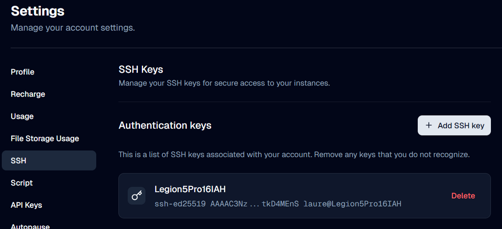

Go to the API Keys section in Settings, then click on the Generate API Key button.

Click on the button next to the generated API key to copy it.

Then create a text file %WORDSLAB_WINDOWS_HOME%/.secrets/jarvislabs-api-key (without .txt extension.) on your windows client machine.

Paste the generated API key in this file on client machine.

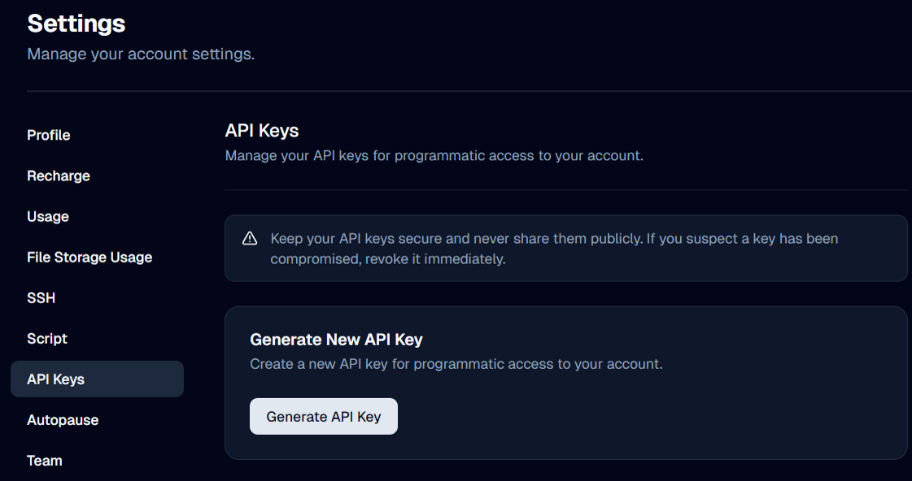

## 3. Create a persistent disk in the cloud

Click on Jarvislabs.ai in the top left.

Go to Menu / File Storage.

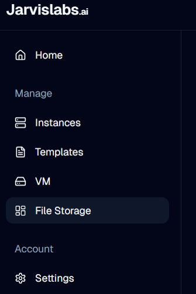

Click on Create New: choose a name, for example "storage-70G", and configure the size of the persistent storage you need in GB.

The minimum size to install wordslab is 35 GB if you rent a small GPU (8 GB), and 70 GB if you rent a bigger GPU (24 GB or more).

See [Estimating the storage size](cloud-machines.md).

Then click on the Create button.

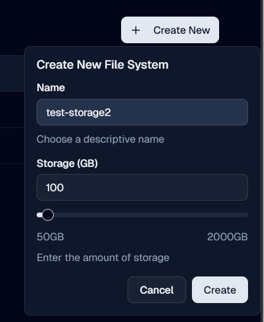

## 4. Rent a virtual machine for a few hours

Go to Menu / Templates.

Click on Pytorch.

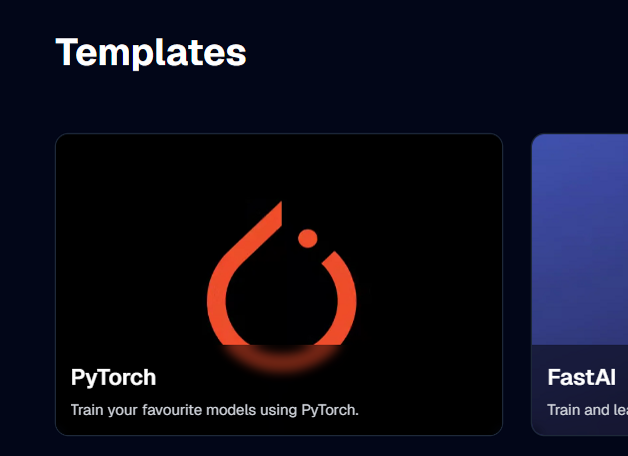

Select the GPU you want to use, for example: A5000 Pro.

See [Choosing a GPU to run a generative AI application](cloud-machines.md).

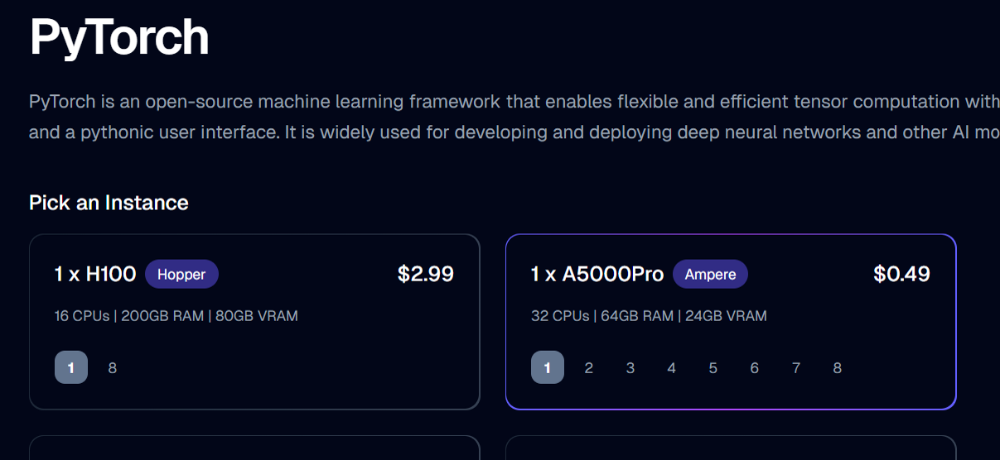

Reduce the storage configuration for the operating system to 20 GB.

Click on Advanced Settings.

Choose a name for your virtual machine, for example: "machine-A5000Pro".

Copy and paste the list of 9 ports below in HTTP Ports Configuration:

```
8880,8881,8882,8883,8884,8885,8886,8887,8888
```

Select the file storage you just created.

Click on the Launch instance button.

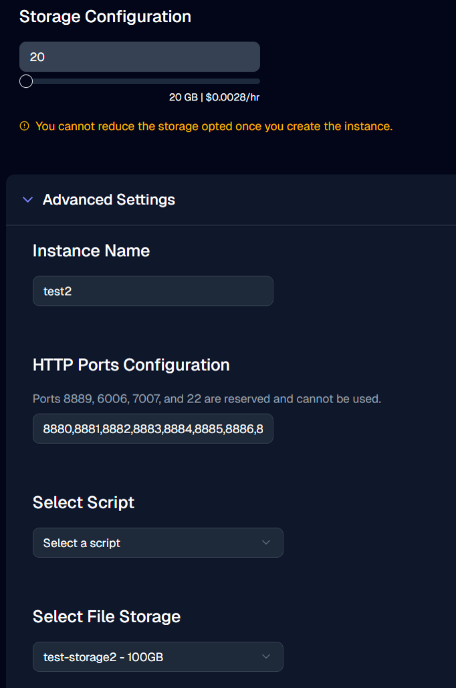

Wait a few second while the instance is created.

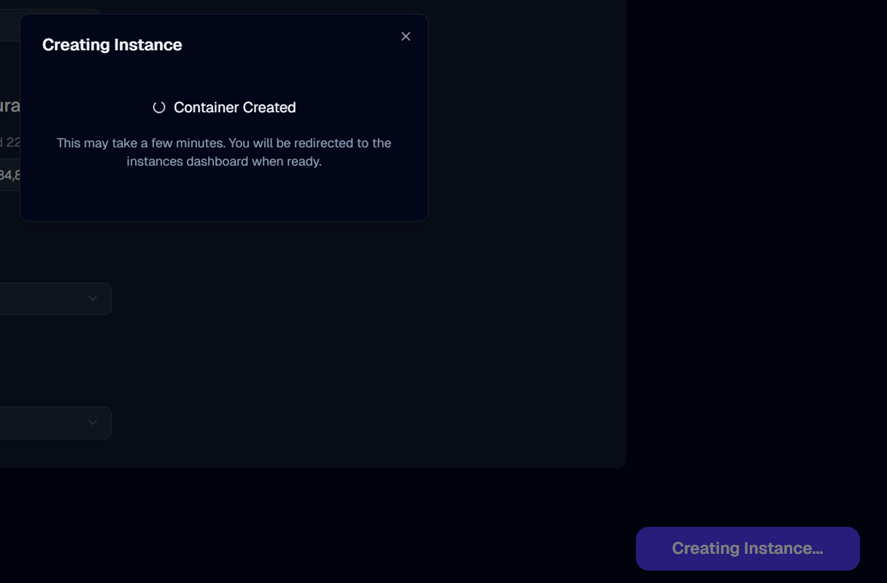

Go to Menu / Instances to see your running instance.

Click on the >_ SSH button to copy the command suggested by Jarvislabs to access your instance, then paste it in your terminal to see it (but don't execute it - enter Ctrl-C) for example:

```shell
ssh -o StrictHostKeyChecking=no -p 11014 root@sshq.jarvislabs.ai
```

Take note of the DNS name of your virtual machine, in this example: sshq.jarvislabs.ai

Take note of the SSH port of your virtual machine, in this example: 11014

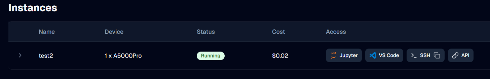

## 5. Install wordslab-notebooks on your persistent disk (the first time only)

IMPORTANT: you only need to do this once, the first time you launch a virtual machine with a newly created persistent disk in the cloud. After this initial install, you can directly skip this installation step, and start wordslab-notebooks immediately after you launch a new virtual machine re-using the same persistent disk.

Open a terminal on your Windows machine and execute the command below.

```shell
set "WORDSLAB_WINDOWS_HOME=C:\wordslab" && call set "WORDSLAB_VERSION=2025-08" && call cd "%WORDSLAB_WINDOWS_HOME%\wordslab-notebooks-%WORDSLAB_VERSION%" && call install-wordslab-notebooks.bat [virtual machine IP address] [virtual machine SSH port]
```

For example:

```shell
set "WORDSLAB_WINDOWS_HOME=C:\wordslab" && call set "WORDSLAB_VERSION=2025-08" && call cd "%WORDSLAB_WINDOWS_HOME%\wordslab-notebooks-%WORDSLAB_VERSION%" && call install-wordslab-notebooks.bat sshq.jarvislabs.ai 11014
```


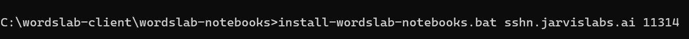

The script will run several minutes to download and install all the necessary software on the persistent disk in the cloud.

At the end of the installation process, the script will display the following lines

```
-------------------
END OF INSTALLATION
-------------------

To start wordslab-notebooks:

cd /workspace
./start-wordslab-notebooks.sh
```

## 6. Start wordslab-notebooks on your virtual machine

Open a terminal on your Windows machine and execute the command below.

```shell
set "WORDSLAB_WINDOWS_HOME=C:\wordslab" && call "%WORDSLAB_WINDOWS_HOME%\start-wordslab-notebooks.bat" [virtual machine IP address] [virtual machine SSH port]
```

For example:

```shell
set "WORDSLAB_WINDOWS_HOME=C:\wordslab" && call "%WORDSLAB_WINDOWS_HOME%\start-wordslab-notebooks.bat" sshq.jarvislabs.ai 11014
```

The script may need to reinstall a few Ubuntu packages on the temporary disk of the new virtual machine.

At the end of the startup process, the script will display a link to the wordslab-notebooks dashboard.

Click on this link to access the applications.

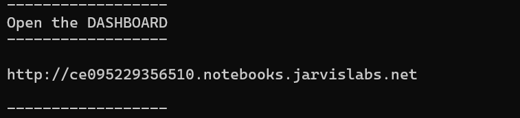

## 7. Stop wordslab-notebooks and Terminate your virtual machine

IMPORTANT: don't forget to terminate your virtual machine when your work session is finished.

Go to the open terminal on your Windows machine from which you started wordslab-notebooks.

Input [Ctrl]+[C] to stop the wordslab-notebooks applications.

Then go to the Jarvislabs website in your internet browser.

Go to Menu / Instances.

On the line of the virtual machine you want to stop, click on the red Delete Instance button => your virtual machine is destroyed and it not billed to your account anymore (but your persistent storage will continue to be billed).