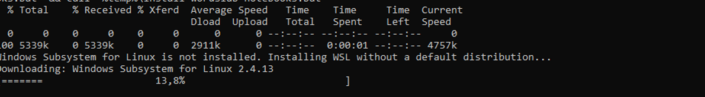
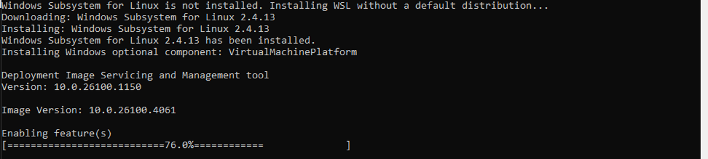
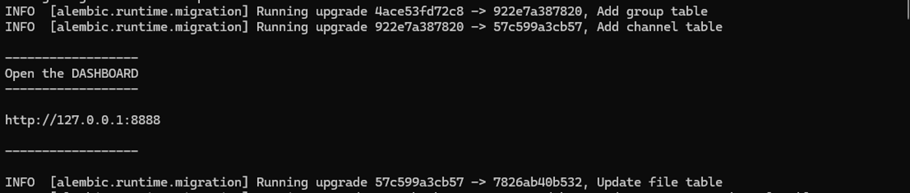

# Install wordslab on a Local PC

Choose 3 directories on your machine

WORDSLAB_HOME : wordslab installation scripts and virtual disk containing the Linux virtual machine OS and all applications installed by wordslab (initial size 20 GB) - default: c:\wordslab

WORDSLAB_WORKSPACE : virtual disk containing your projects code and data + their specific software dependencies (initial size 0 GB) - default: %WORDSLAB_HOME%\virtual-machines\wordslab-workspace

WORDSLAB_MODELS : virtual disk containing all the AI models initially installed by wordslab and then downloaded in the course of your projects (initial size 30 GB) - default: %WORDSLAB_HOME%\virtual-machines\wordslab-models
		
If your machine has several physical disks or partitions, you can split your wordslab install between all of them to best use your available storage space.
	
Avoid choosing directories which are automatically synchronized with a remote storage service like OneDrive because the virtual disks files are huge and are continously updated.
	
Choose a disk with a fast reading speed for WORDSLAB_MODELS or you will have to wait several minutes each time you want load a 10+ GB model in memory.

the script wil automatically create the directories if they don't already exist

if the Windows Subsystem for Linux is not yet installed on your machine
	- the script will prompt you for administrator access
	- then the script will ask you to reboot your machine once
	- after reboot, relaunch the same command as above a second time to continue and finish the installation 

The installation scripts will download up to 50 GB, the install time will mainly depend of your network bandwidth

Parameters for special cases (you shouldn't need them)

- you can add the -cpu flag to the install command if you want to force a CPU-only install even if a Nvidia GPU is available on your machine 

- you can add the -name <virtual-machine-name> parameter if you want to install several versions of wordslab notebooks in parallel on the same machine: the workspace and models virtual disks will be shared between these versions (default virtual machine name: wordslab-notebooks)

## Windows installation instructions

### Windows install commands

1. Right-click on the Windows start icon


2. Type the three letters "cmd", then click on "Run as administrator"


3. This will open the Command Prompt with administrator privileges


4. Copy / paste the installation command below in the terminal

```shell
set "WORDSLAB_WINDOWS_HOME=C:\wordslab" && call set "WORDSLAB_WINDOWS_WORKSPACE=%WORDSLAB_WINDOWS_HOME%\virtual-machines\wordslab-workspace"  && call set "WORDSLAB_WINDOWS_MODELS=%WORDSLAB_WINDOWS_HOME%\virtual-machines\wordslab-models" && call set "WORDSLAB_VERSION=2025-05" && call curl -sSL "https://raw.githubusercontent.com/wordslab-org/wordslab-notebooks/refs/tags/%WORDSLAB_VERSION%/install-wordslab-notebooks.bat" -o "%temp%\install-wordslab-notebooks.bat" && call "%temp%\install-wordslab-notebooks.bat"
```


5. Personalize the installation paths on your computer, and select the version you want to install

- set "WORDSLAB_WINDOWS_HOME=C:\wordslab" 
- set "WORDSLAB_WINDOWS_WORKSPACE=%WORDSLAB_WINDOWS_HOME%\virtual-machines\wordslab-workspace" 
- set "WORDSLAB_WINDOWS_MODELS=%WORDSLAB_WINDOWS_HOME%\virtual-machines\wordslab-models"
- set WORDSLAB_VERSION=2025-05

Press Enter to launch the installation script

6. OPTION 1: The Windows Subsystem for Linux is already installed on your machine


=> the script will jump directly to step 9.

6. OPTION 2: The Windows Subsystem for Linux is downloaded



7. The Windows Virtual Machine Platform is downloaded and installed



You may have to wait several minutes fot the downloads and install to complete …

8. When prompted by the script, press "y" to reboot the machine.


The Windows updates will be applied during the reboot.

=> After the reboot, please restart the exact same install procedure at step 1

9. The wordlabs-notebooks virtual machine and virtual disks are created


=> The next installation steps will be executed automatically inside the Linux virtual machine without any user intervention

=> they are identical for a Windows or Linux install, see below

### wordslab-notebooks installation steps

1. Ubuntu packages and Docker (only if the script is not already running inside a docker container)


2. Python and uv package manager


3. Jupyterlab and several key extensions


4. Visual Studio Code and several key extensions, Aider


5. ollama


6. 3 language models for chat, code and embeddings


7. Open WebUI


7. Open WebUI dependencies


8. End of installation


### Windows start and stop commands

1. Copy / paste the start command below in the terminal

```bash
set "WORDSLAB_WINDOWS_HOME=C:\wordslab" && call "%WORDSLAB_WINDOWS_HOME%\start-wordslab-notebooks.bat"
```

2. Personalize the installation paths on your computer

- set "WORDSLAB_WINDOWS_HOME=C:\wordslab" 

Press Enter to launch the startup script

=> The next startup steps will be executed automatically inside the Linux virtual machine without any user intervention

=> they are identical on a Windows or Linux machine, see below

### wordslab-notebooks startup steps

1. The server processes are launched one after the other and they display status messages in the terminal


2. Check the messages displayed in the terminal until you see the following message 

```
------------------
Open the DASHBOARD
------------------
```




3. Ctrl-clik on the link which is displayed just below to open the wordslab dashboard (or copy-paste this link in your browser)

```
http://127.0.0.1:8888
```

You should see the wordslab-notebooks dashboard

- Click on the 3 big tiles to launch the main wordslab applications
  - Chat => Open WebUI
  - Notebooks => JupyterLab
  - Code => Visual Studio

- Click on the links below "User applications" if you launched a user-specific server listening on $USER_APPn_PORT inside the virtual machine

- Check the CPU, GPU, and disk usage to manage your hardware resources


4. To stop all the wordslab servers, just press simultaneously the following keys in the terminal window

```
[Ctrl]+[C]
```


5. **IMPORTANT** - If you are not running wordslab-notebooks on a local PC, don't forget to then go to your cloud provider website to shutdown your virtual machine !!

## Linux installation instructions

### Linux install commands

1. If you are not logged in as root, first make sure that you will execute the install script with administrator privileges

```bash
sudo bash
```

You will need to enter your password.

2. Copy / paste the installation command below in the terminal

```bash
apt update && apt install -y curl && export WORDSLAB_HOME=/home/wordslab && export WORDSLAB_WORKSPACE=$WORDSLAB_HOME/workspace && export WORDSLAB_MODELS=$WORDSLAB_HOME/models && export WORDSLAB_VERSION=2025-05 && curl -sSL https://raw.githubusercontent.com/wordslab-org/wordslab-notebooks/refs/tags/$WORDSLAB_VERSION/install-wordslab-notebooks.sh | bash
```

3. Personalize the installation paths on your computer, and select the version you want to install

- export WORDSLAB_HOME=/home/wordslab
- export WORDSLAB_WORKSPACE=$WORDSLAB_HOME/workspace 
- export WORDSLAB_MODELS=$WORDSLAB_HOME/models
- export WORDSLAB_VERSION=2025-05

Press Enter to launch the installation script

=> The next installation steps will be executed automatically without any user intervention

=> they are identical for a Windows or Linux install, see the section "wordslab-notebooks installation steps" above

### Linux start and stop commands

1. Copy / paste the start command below in the terminal

```bash
export WORDSLAB_HOME=/home/wordslab && $WORDSLAB_HOME/start-wordslab-notebooks.sh
```

2. Personalize the installation paths on your computer

- export WORDSLAB_HOME=/home/wordslab

Press Enter to launch the startup script

=> The next startup steps will be executed automatically without any user intervention

=> they are identical for a Windows or Linux machine, see the section "wordslab-notebooks startup steps" above

## Storage directories size (MB)

Please note that the exact install size will vary for each wordslab version and also depends on your GPU memory capacity (wordslab downloads bigger models by default if your GPU has more VRAM): the numbers below should be seen as a minimum.

Minimal install size = **24 GB**

### WORDSLAB_HOME disk

**18.1 GB**

System	
- Operating system:	1580
- Root user:	175

Applications	
- JupyterLab:	110
- Visual Studio:	398
- Ollama:	3221
- Open WebUI:	656

Python packages	
- torch-2.6.0+cu124:	1510
- vllm-0.8.5.post1:	1016
- nvidia_cudnn_cu12-9.1.0.70:	976
- triton-3.2.0:	684
- nvidia_cublas_cu12-12.4.5.8:	527
- open_webui-0.6.12:	378
- nvidia_cufft_cu12-11.2.1.3:	280
- nvidia_cusparse_cu12-12.3.1.170:	268
- nvidia_nccl_cu12-2.21.5:	240
- cupy_cuda12x-13.4.1:	216
- hf_xet-1.1.0:	209
- ... and many others

### WORDSLAB_WORKSPACE disk

**0.8GB**

Workspace projects	
- wordslab-notebooks-tutorials:	198

Applications data	
- JupyterLab data:	0
- Visual Studio data:	295
- Open WebUI data:	0

### WORDSLAB_MODELS disk

**4.4 GB** for GPUs with 8 GB VRAM *(bigger models are downloaded on bigger GPUs)*

Ollama models	
- gemma3:4b:	3184
- qwen2.5-coder:1.5b-base:	940
- nomic-embed-text:latest:	261

vLLM models	
- none after install