# Install wordslab on Runpod.io

## 1. Prepare the Windows client machine

Open a terminal on your Windows machine and execute one of the commands below.

Option 1: if wordslab-notebooks is not yet installed on your Windows machine

```shell
set "WORDSLAB_WINDOWS_HOME=C:\wordslab" && call set "WORDSLAB_VERSION=2025-10" && call curl -sSL https://raw.githubusercontent.com/wordslab-org/wordslab-notebooks/refs/tags/%WORDSLAB_VERSION%/prepare-client-machine.bat -o "%temp%\prepare-client-machine.bat" && call "%temp%\prepare-client-machine.bat"
```

Option 2: if wordslab-notebooks is already installed on your Windows machine

```shell
set "WORDSLAB_WINDOWS_HOME=C:\wordslab" && call set "WORDSLAB_VERSION=2025-10" && call cd "%WORDSLAB_WINDOWS_HOME%\wordslab-notebooks-%WORDSLAB_VERSION%" && call prepare-client-machine.bat
```

This command will download the installation scripts if necessary, and it will generate a secret **SSH key** to connect to the cloud virtual machine.

```shell
To install wordslab-notebooks on a cloud server machine, you can now execute the following steps:

1. Register your public SSH key with a cloud provider
--- COPY THE LINE BELOW ---
ssh-ed25519 AAAAC3NzaC1lZDI1NTE5XXXXXXXXXXXXoh+wLXsBc0Dpj6iiIILpZuq+NvfzxkiuQT4 laure@Legion5Pro16IAH
--- COPY THE LINE ABOVE ---

2. Select, configure and start a cloud machine, then display the SSH command to access the machine

3. Execute the following script to install wordlsab-notebooks on the cloud machine
> install-wordslab-notebooks.bat [linux server SSH address] [linux server SSH port](optional: default=22 )
```

You can copy your SSH public key from the output of the command, or find it later in the text file:

```shell
C:\wordslab\secrets\ssh-key.pub
```

## 2. Create an account on Runpod.io

Open your browser and navigate to [https://console.runpod.io/signup](https://console.runpod.io/signup).

Create an account.

Buy Runpod Credits with your credit card - for example 25$.

Then go to Menu / Settings.

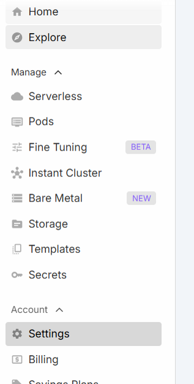

Scroll to the bottom of the page and click on the SSH Public Keys section.

Copy and paste your SSH public key in the input area.

Click on Update Public Key button.

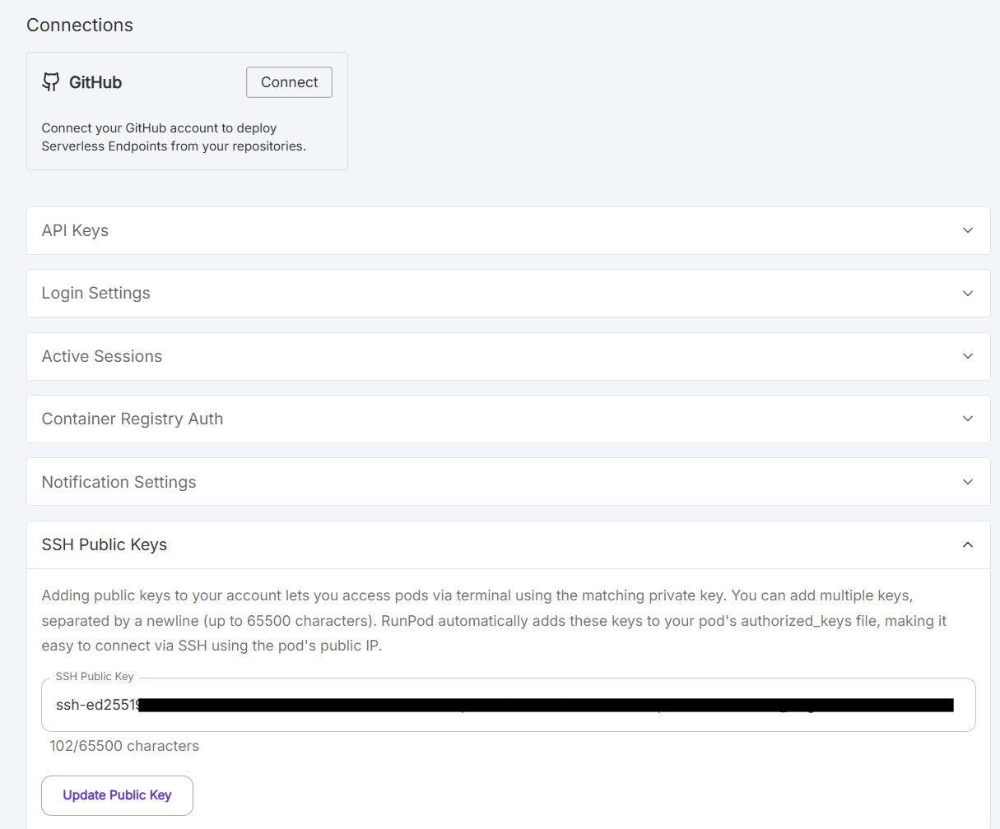

## 3. Create a persistent disk in the cloud

Go to Menu / Storage.

Click on the New Network Volume button.

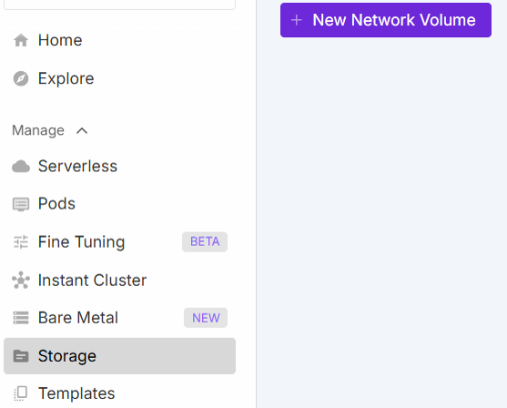

Select a datacenter
- check if the GPU types you want to use are available on the right of the screen
- choose a datacenter near you

Take your time to select the right datacenter for you needs, because your persistent disk will only be accessible from virtual machines hosted in this datacenter, and with the GPUs available in this datacenter.

For example, EU-RO-1 seems to be a good choice.

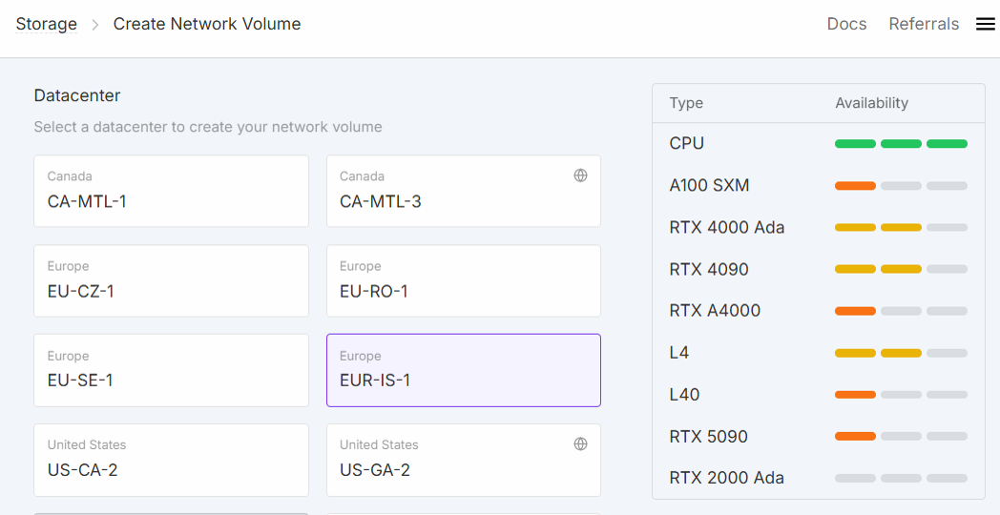

Then enter a name for your persistent disk, for example: "volume-EU-RO-1-100GB".

Configure the disk size in GB.

The minimum size to install wordslab is 35 GB if you rent a small GPU (8 GB), and 70 GB if you rent a bigger GPU (24 GB or more).

See [Estimating the storage size](cloud-machines.md).

WARNING: The price per month displayed on the screen will be billed to your account until you choose to delete your persistent disk.

Click on the Create Network Volume button.

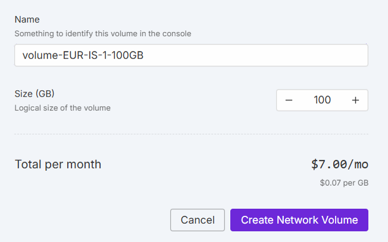

## 4. Rent a virtual machine for a few hours

Go to Menu / Pods

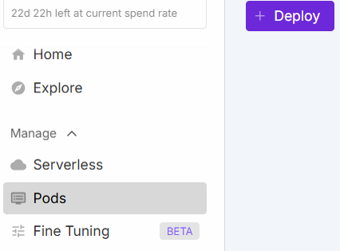

Click on Netwok Volume on the top of the screen.

Select your persistent disk, for example: "volume-EU-RO-1-100GB". 

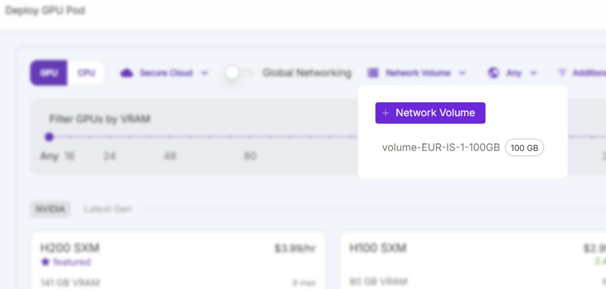

Select the GPU you want to use, for example: RTX 5090.

See [Choosing a GPU to run a generative AI application](cloud-machines.md).

Then scroll to the bottom section of the page.

Enter a pod name, for example: "pod-rtx5090".

Select a pod template: you MUST use "Runpod Pytorch 2.8.0".

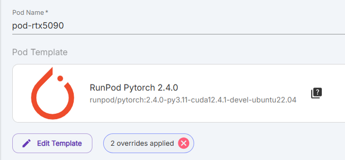

Click on the Edit template button.

Copy and paste the list of 9 ports below in the "Expose HTTP ports (Max 10)" input area:

```
8880,8881,8882,8883,8884,8885,8886,8887,8888
```

Click on the button Set Overrides.

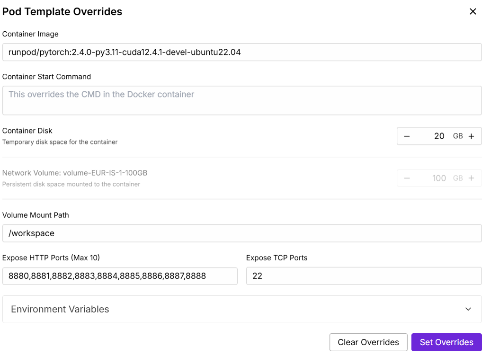

Scroll to the bottom of the screen.

Uncheck the checkbox: "Start Jupyter Notebook".

Click on the button Deploy On-Demand.

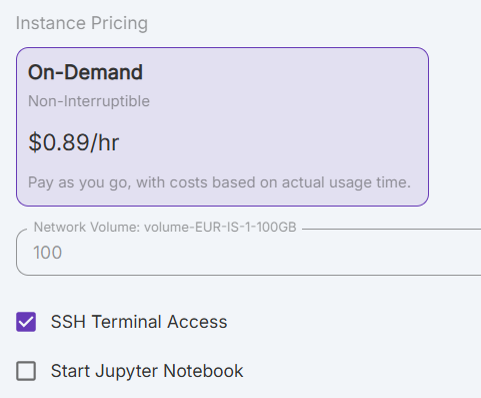

WARNING: The price per hour displayed on the screen will be billed to your account until you choose to stop your virtual machine.

A list of your running virtual machines is now displayed on the screen.

Click on the virtual machine you just launched.

The properties of the virtual machine are displayed as an overlay on the right of the screen (the layout may look a little bit different than the old screenshot below).

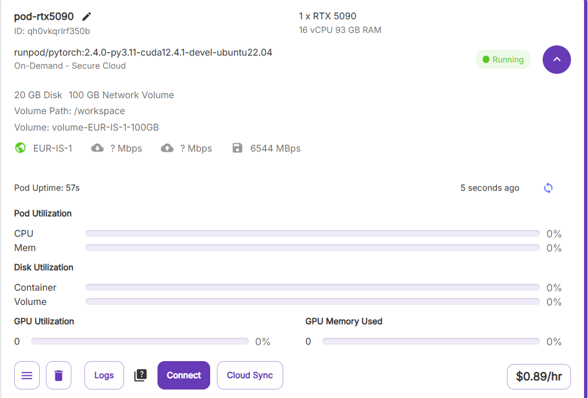

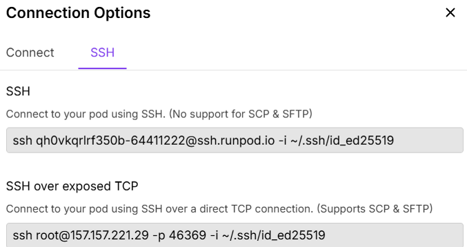

Find the "SSH exposed over TCP" command at the bottom of this window, for example:

```shell
ssh root@213.173.103.6 -p 34046 -i ~/.ssh/id_ed25519
```

Take note of the IP address of your virtual machine, in this example: 213.173.103.6

Take note of the SSH port of your virtual machine, in this example: 34046

## 5. Install wordslab-notebooks on your persistent disk (the first time only)

IMPORTANT: you only need to do this once, the first time you launch a virtual machine with a newly created persistent disk in the cloud. After this initial install, you can directly skip this installation step, and start wordslab-notebooks immediately after you launch a new virtual machine re-using the same persistent disk.

Open a terminal on your Windows machine and execute the command below.

```shell
set "WORDSLAB_WINDOWS_HOME=C:\wordslab" && call set "WORDSLAB_VERSION=2025-10" && call cd "%WORDSLAB_WINDOWS_HOME%\wordslab-notebooks-%WORDSLAB_VERSION%" && call install-wordslab-notebooks.bat [virtual machine IP address] [virtual machine SSH port]
```

For example:

```shell
set "WORDSLAB_WINDOWS_HOME=C:\wordslab" && call set "WORDSLAB_VERSION=2025-10" && call cd "%WORDSLAB_WINDOWS_HOME%\wordslab-notebooks-%WORDSLAB_VERSION%" && call install-wordslab-notebooks.bat 213.173.103.6 34046
```

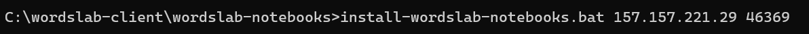

The script will run several minutes to download and install all the necessary software on the persistent disk in the cloud.

At the end of the installation process, the script will display the following lines

```
-------------------
END OF INSTALLATION
-------------------

To start wordslab-notebooks:

cd /workspace
./start-wordslab-notebooks.sh
```

## 6. Start wordslab-notebooks on your virtual machine

Open a terminal on your Windows machine and execute the command below.

```shell
set "WORDSLAB_WINDOWS_HOME=C:\wordslab" && call "%WORDSLAB_WINDOWS_HOME%\start-wordslab-notebooks.bat" [virtual machine IP address] [virtual machine SSH port]
```

For example:

```shell
set "WORDSLAB_WINDOWS_HOME=C:\wordslab" && call "%WORDSLAB_WINDOWS_HOME%\start-wordslab-notebooks.bat" 213.173.103.6 34046
```

The script may need to reinstall a few Ubuntu packages on the temporary disk of the new virtual machine.

At the end of the startup process, the script will display a link to the wordslab-notebooks dashboard.

Click on this link to access the applications.


## 7. Stop wordslab-notebooks and Terminate your virtual machine

IMPORTANT: don't forget to terminate your virtual machine when your work session is finished.

Go to the open terminal on your Windows machine from which you started wordslab-notebooks.

Input [Ctrl]+[C] to stop the wordslab-notebooks applications.

Then go to the Runpod website in your internet browser.

Go to Menu / Pods.

Click on the virtual machine you want to stop.

Click on the red Terminate button => your virtual machine is destroyed and it not billed to your account anymore (but your persistent storage will continue to be billed).