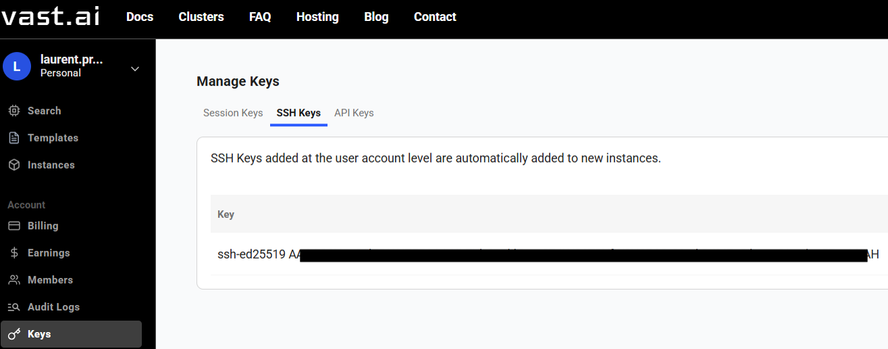
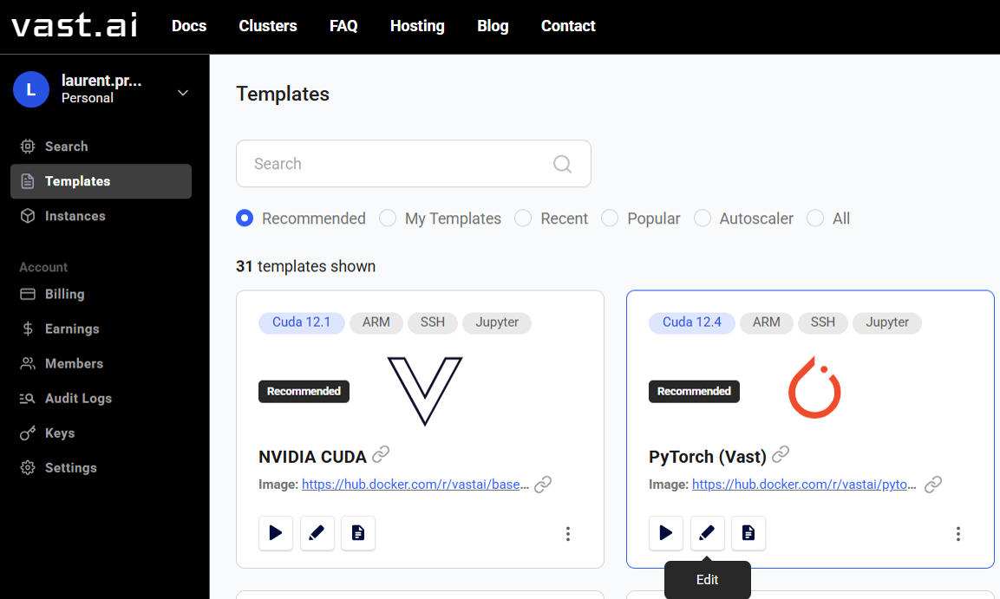
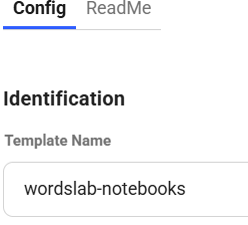
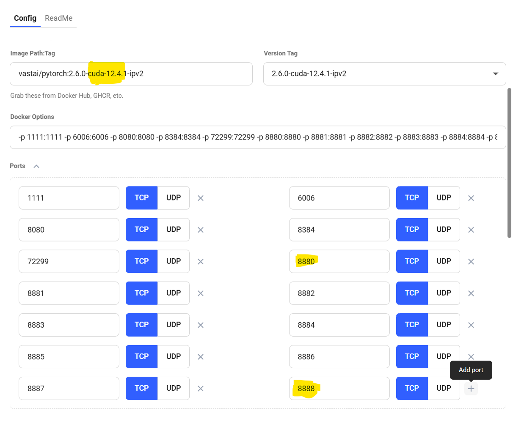
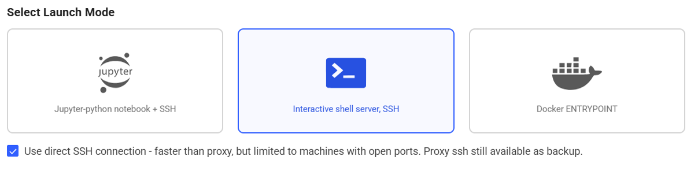
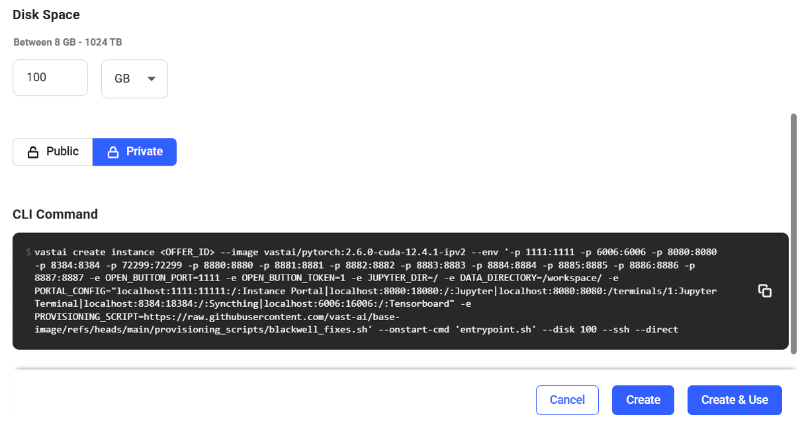
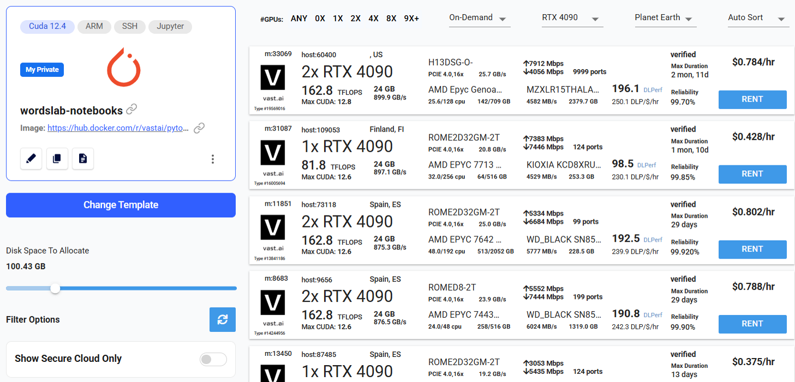
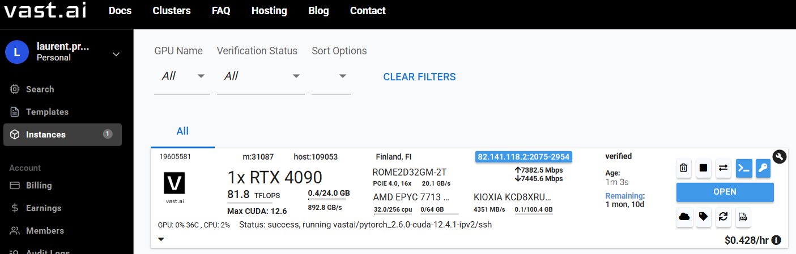
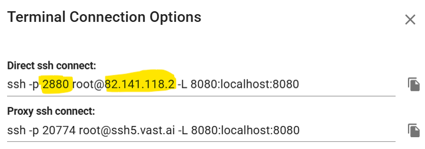
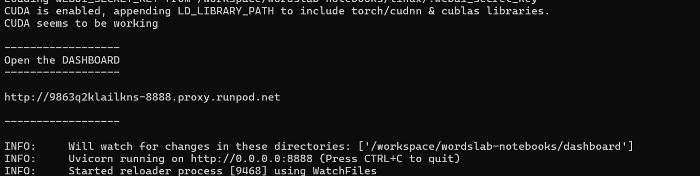

# Install wordslab on Vast.ai

## 1. Prepare the Windows client machine

Open a terminal on your Windows machine and execute one of the commands below.

Option 1: if wordslab-notebooks is not yet installed on your Windows machine

```shell
set "WORDSLAB_WINDOWS_HOME=C:\wordslab" && call set "WORDSLAB_VERSION=2026-01" && call curl -sSL https://raw.githubusercontent.com/wordslab-org/wordslab-notebooks/refs/tags/%WORDSLAB_VERSION%/prepare-client-machine.bat -o "%temp%\prepare-client-machine.bat" && call "%temp%\prepare-client-machine.bat"
```

Option 2: if wordslab-notebooks is already installed on your Windows machine

```shell
set "WORDSLAB_WINDOWS_HOME=C:\wordslab" && call set "WORDSLAB_VERSION=2026-01" && call cd "%WORDSLAB_WINDOWS_HOME%\wordslab-notebooks-%WORDSLAB_VERSION%" && call prepare-client-machine.bat
```

This command will download the installation scripts if necessary, and it will generate a secret **SSH key** to connect to the cloud virtual machine.

```shell
To install wordslab-notebooks on a cloud server machine, you can now execute the following steps:

1. Register your public SSH key with a cloud provider
--- COPY THE LINE BELOW ---
ssh-ed25519 AAAAC3NzaC1lZDI1NTE5XXXXXXXXXXXXoh+wLXsBc0Dpj6iiIILpZuq+NvfzxkiuQT4 laure@Legion5Pro16IAH
--- COPY THE LINE ABOVE ---

2. Select, configure and start a cloud machine, then display the SSH command to access the machine

3. Execute the following script to install wordlsab-notebooks on the cloud machine
> install-wordslab-notebooks.bat [linux server SSH address] [linux server SSH port](optional: default=22 )
```

You can copy your SSH public key from the output of the command, or find it later in the text file:

```shell
C:\wordslab\secrets\ssh-key.pub
```

## 2. Create an account on Vast.ai

Open your browser and navigate to [https://cloud.vast.ai/](https://cloud.vast.ai/).

Click on the Login button in the top right, then click on the Signup link.

Create an account.

Buy Vast.ai Credits with your credit card - for example 25$.

Go to Menu / Keys.

In the SSH Keys tab, click on the [+ New] button.

Paste your SSH public key and click on the Save button.



## 3. Create a template to deploy wordslab-notebooks virtual machines

Go to Menu / Templates.

Select the template Pytorch (Vast).

Click on the Edit button (which looks like a pen).



Change the Template Name: wordslab-notebooks.



In the ports section, click on the + button to Add ports
- Add 9 ports from 8880, 8881 ... to 8888



Select Launch Mode: Interactive shell server, SSH.



Configure the Disk space in GB.

The minimum size to install wordslab is 60 GB if you rent a small GPU (8 GB), and 100 GB if you rent a bigger GPU (24 GB or more).

See [Estimating the storage size](cloud-machines.md).

Click on the Private button.

Then finalize and save the template: click on the Create & Use button.



## 4. Rent a virtual machine for a few hours

Select the GPU you want to use, for example: RTX 5090.

See [Choosing a GPU to run a generative AI application](cloud-machines.md).

Make sure that you choose a machine with a **good internet bandwidth** to accelerate the downloads.

**IMPORTANT** make sure that the Max CUDA version avialable on the machine is at least 12.9.

Click on the RENT button.

WARNING: The price per hour displayed on the screen will be billed to your account until you choose to stop your virtual machine.



Go to Menu / Instances.

A list of your running virtual machines is now displayed on the screen.

Wait for a few seconds or a few minutes before your rented machine is ready. Look at the bottom of the tile
- Status: not running
- Status: success, running vastai/pytorch_cuda-13.0.2-auto/ssh

Click on the >_ "Open terminal access" button.



Look at the Direct SSH connect command to get the IP address and SSH port of the virtual machine, for example:

```shell
ssh -p 40745 root@92.244.210.137 -L 8080:localhost:8080
```

Take note of the IP address of your virtual machine, in this example: 92.244.210.137

Take note of the SSH port of your virtual machine, in this example: 40745



## 5. Install wordslab-notebooks on your persistent disk (the first time only)

IMPORTANT: you only need to do this once, the first time you launch a virtual machine with a newly created persistent disk in the cloud. After this initial install, you can directly skip this installation step, and start wordslab-notebooks immediately after you launch a new virtual machine re-using the same persistent disk.

Open a terminal on your Windows machine and execute the command below.

```shell
set "WORDSLAB_WINDOWS_HOME=C:\wordslab" && call set "WORDSLAB_VERSION=2026-01" && call cd "%WORDSLAB_WINDOWS_HOME%\wordslab-notebooks-%WORDSLAB_VERSION%" && call install-wordslab-notebooks.bat [virtual machine IP address] [virtual machine SSH port]
```

For example:

```shell
set "WORDSLAB_WINDOWS_HOME=C:\wordslab" && call set "WORDSLAB_VERSION=2026-01" && call cd "%WORDSLAB_WINDOWS_HOME%\wordslab-notebooks-%WORDSLAB_VERSION%" && call install-wordslab-notebooks.bat 92.244.210.137 40745
```

The script will run several minutes to download and install all the necessary software on the persistent disk in the cloud.

At the end of the installation process, the script will display the following lines

```
-------------------
END OF INSTALLATION
-------------------

To start wordslab-notebooks:

cd /workspace
./start-wordslab-notebooks.sh
```

## 6. Start wordslab-notebooks on your virtual machine

Open a terminal on your Windows machine and execute the command below.

```shell
set "WORDSLAB_WINDOWS_HOME=C:\wordslab" && call "%WORDSLAB_WINDOWS_HOME%\start-wordslab-notebooks.bat" [virtual machine IP address] [virtual machine SSH port]
```

For example:

```shell
set "WORDSLAB_WINDOWS_HOME=C:\wordslab" && call "%WORDSLAB_WINDOWS_HOME%\start-wordslab-notebooks.bat" 92.244.210.137 40745
```

The script may need to reinstall a few Ubuntu packages on the temporary disk of the new virtual machine.

At the end of the startup process, the script will display a link to the wordslab-notebooks dashboard.

Click on this link to access the applications.



## 7. Stop wordslab-notebooks and Terminate your virtual machine

IMPORTANT: don't forget to terminate your virtual machine when your work session is finished.

Go to the open terminal on your Windows machine from which you started wordslab-notebooks.

Input [Ctrl]+[C] to stop the wordslab-notebooks applications.

Then go to the Vast.ai website in your internet browser.

Go to Menu / Instances.

Find the virtual machine you want to stop.

Click on the "Stop your instance" button => your virtual machine is stopped and it is not billed to your account anymore. But your storage is still persistent and continues to be billed.

Or click on the "Terminate your instance" button => your virtual machine is stopped and your storage is destroyed. Your are not billed anymore, BUT ALL YOUR WORKSPACE DATA IS DELETED FOREVER.